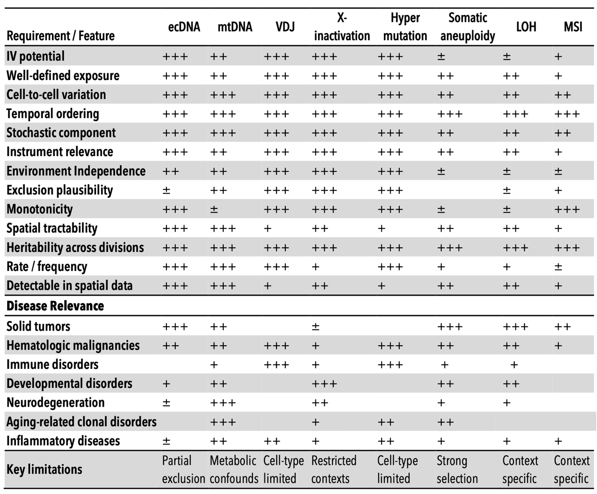
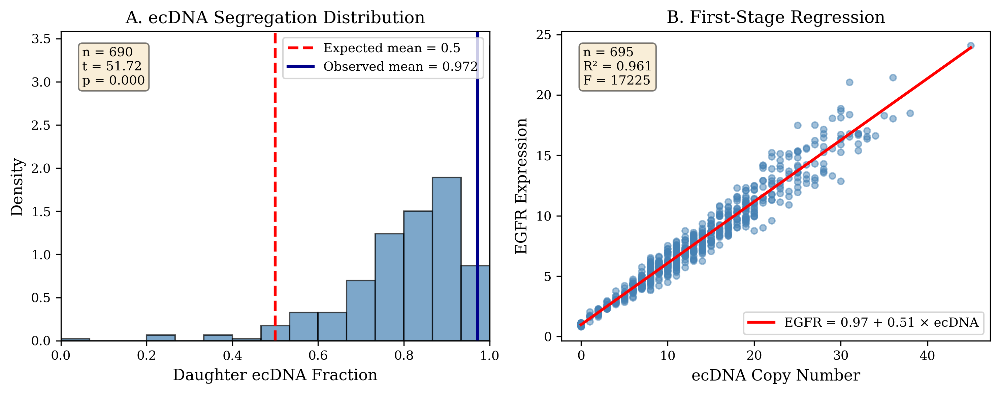
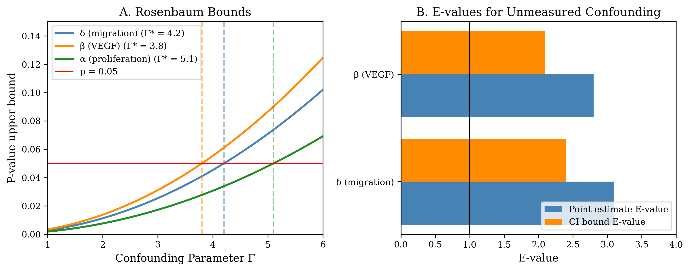
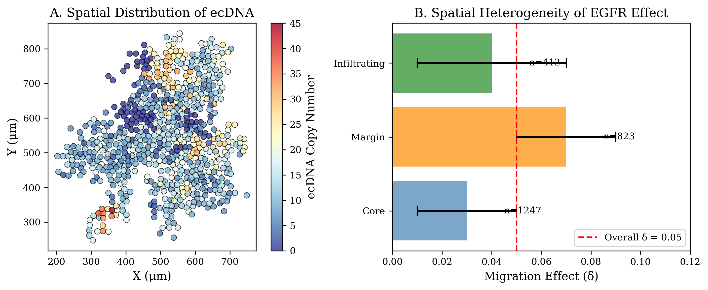

<link rel="stylesheet" href="assets/style.css">

# Extrachromosomal DNA as a Causal Instrument for Spatial Multi-Omics

David W. Craig1* and Andrei S. Rodin2

1Department of Integrative Translational Science, Beckman Research Institute, City of Hope, Duarte, CA, USA. 
2Department of Computational Medicine, Beckman Research Institute, City of Hope, Duarte, CA, USA.

*Correspondence: David W. Craig: <a href="mailto:dacraig@coh.org">dacraig@coh.org</a>

---

## Abstract

Spatial transcriptomics, proteomics, and computational pathology produce richly detailed maps of tissue organization, yet the analytical methods applied to these data remain fundamentally correlational, unable to distinguish causal drivers from their downstream consequences. We propose a theoretical framework for causal inference in spatial multi-omics that exploits a unique property of extrachromosomal DNA: because ecDNA lacks a centromere, it segregates stochastically during mitosis, generating cell-to-cell variation in oncogene dosage that is independent of microenvironmental confounders. This cell-intrinsic randomization satisfies the conditions for an instrumental variable, converting ecDNA copy number into a biologically grounded causal instrument that can separate upstream oncogenic drivers from the transcriptional, morphological, and immune microenvironmental changes they produce in intact tissue.

We formalize this reasoning within a structural causal model and develop the statistical machinery for two-stage causal effect estimation, falsification diagnostics, and sensitivity analyses applicable to settings where clustering and correlation-based approaches cannot resolve directionality. We demonstrate the framework's logic by deriving estimable causal effects of ecDNA-amplified oncogene dosage on downstream malignant programs, constructing spatial maps that distinguish driver from passenger processes, reconstructing clonal phylogenies anchored by irreversible genomic events including loss of heterozygosity and mitochondrial variants, and specifying counterfactual tissue architectures under virtual perturbation.

In tumors harboring multiple independent ecDNA species, each carrying distinct oncogenes, the framework enables multi-instrument analyses analogous to factorial experiments within a single tissue section. ecDNA serves as both the motivating application and validation anchor: its randomized inheritance provides a natural experiment for causal estimation, and its genomic ground truth from paired sequencing enables future benchmarking of causal discovery against known structure. The same instrumental logic generalizes to other forms of heritable somatic mosaicism beyond ecDNA.

---

# Introduction

## Causal Reasoning Methods for Spatial Multi-omics

Spatial transcriptomics and multiplex imaging technologies have revolutionized tissue characterization, yet computational analysis remains confined to pattern identification: clustering, trajectory inference, and correlation-based biomarker discovery. These approaches identify what features co-occur but cannot determine whether a molecular change is a cause, consequence, or coincidental byproduct of local tissue context [[Jain, 2024]](#ref-jain2024). This limitation is not merely academic. Without causal identification, spatial data cannot answer the questions most relevant for translational science: which molecular events drive tissue states, how these states evolve, and how tissues would respond to targeted interventions [[Bissell, 2005]](#ref-bissell2005)[[Fan, 2024]](#ref-fan2024)[[Shmatko, 2022]](#ref-shmatko2022)[[Vandereyken, 2023]](#ref-vandereyken2023)[[Cui, 2021]](#ref-cui2021).

Current multimodal approaches excel at identifying patterns and correlations but cannot reliably distinguish causes from consequences due to strong influences from the local tissue environment. For example, consider two cells with identical genetic profiles. One cell located near a blood vessel in an oxygen-rich environment may show rapid growth, distinct cell shape, and sensitivity to therapy, while an identical cell in a low-oxygen region may behave quite differently [[Conway, 2001]](#ref-conway2001). These differences arise from local environmental factors rather than intrinsic genetic differences. Similar situations occur throughout spatial biology, where immune cell interactions, extracellular matrix density, stromal cell composition, and local signaling pathways create relationships that obscure the true molecular causes of observed behaviors [[Regev, 2017]](#ref-regev2017). Current computational methods, including our own, further complicate this by blending histological and molecular data into single combined representations optimized for visualization rather than causal interpretation [[Hu, 2021]](#ref-hu2021)[[Pizurica, 2024]](#ref-pizurica2024). While helpful for recognizing important motifs, these combined representations are only a start and do not determine whether changing a specific gene's expression would directly alter cellular morphology. Being able to separate intrinsic genetic effects from those imposed by the environment is critical for accurate therapeutic targeting and biomarker development, yet existing tools do not provide this capability.

## Somatic Variability Enables Causal Inference from Observational Tissue Data

Somatic variations are post-mitotic changes in DNA sequence that propagate through cell division, generating clonal populations with distinct genetic states [[Boveri, 1929]](#ref-boveri1929)[[McClintock, 1953]](#ref-mcclintock1953)[[Burnet, 1959]](#ref-burnet1959). The standard approach for establishing causation relies on controlled intervention, where a variable is perturbed and the resulting effect is measured [[Pearce, 2016]](#ref-pearce2016). In intact tissues, this strategy fails because the required perturbations disrupt the spatial structure under study. Genome editing, drug treatment, and genetic knockouts alter tissue organization, while dissociation removes spatial context entirely. Organoid systems lack key features of native microenvironments, and xenograft models introduce confounding from species differences [[Kim, 2020]](#ref-kim2020). Alternative causal approaches face similar limitations: Mendelian randomization depends on germline variants shared by all cells in a tissue, providing no leverage for distinguishing causal relationships among neighboring cells [[Davey Smith, 2014]](#ref-daveysmith2014).

Our central supposition is that tissues themselves contain a solution through causal inference. Somatic processes generate heritable variation among nearby cells through stochastic events that occur independently of local context. X-chromosome inactivation patterns, mitochondrial DNA mutations, and somatic mosaicism all introduce variation in gene dosage or allelic state among neighboring cells. This variation propagates across cellular descendants, creating clones with distinct molecular states sharing identical microenvironmental contexts [[Moeller, 2024]](#ref-moeller2024). This variation acts as a natural source of quasi-random perturbation, enabling instrumental variable analysis while preserving native tissue architecture.

## Instrumental Variables: A Path from Correlation to Causation

The econometrics and epidemiology literatures have long addressed this problem in settings where direct randomization is not feasible. A central approach is instrumental variable analysis, which uses naturally occurring sources of exogenous variation to identify causal effects from observational data. In this framing, causal reasoning provides the interpretation layer that converts features into mechanistic hypotheses and counterfactual predictions. Causal inference provides the formal framework needed to interpret learned patterns mechanistically by explicitly modeling directionality, separating drivers from passengers, and enabling predictions about how biological systems would respond to perturbation rather than simply describing observed states.

Somatic variation propagates across cellular descendants, creating clones with distinct molecular states sharing identical microenvironmental contexts, and can be considered a **Somatic Instrumental Variable (SIV)** as part of a Structural Causal Model (SCM) [[Pearl, 2010]](#ref-pearl2010). The logic is: if a somatic event 'Z' (the instrument) affects phenotype 'Y' only through its effect on gene expression 'X', and if Z arose independently of current microenvironmental confounders, then the Z→X→Y pathway isolates causal effects. This approach for causal reasoning, foundational in econometrics and epidemiology, has been underutilized in spatial biology because appropriate biological instruments were not recognized [[Greenland, 2002]](#ref-greenland2002). We identify somatic stochasticity as precisely such an instrument. The framework is broadly applicable wherever heritable somatic variation exists: cancer, developmental biology, aging, and neurological disease [[Widding-Havneraas, 2022]](#ref-widding2022).

## Framework and Scope

In this work, we formalize the SIV framework within a structural causal model appropriate for spatial tumor biology, derive the statistical estimators, diagnostics, and sensitivity analyses needed for rigorous causal inference, and develop **CAUSANTA** (Causal Analysis Using Somatic And Neighborhood Tissue Architecture), an analysis and simulation framework that embeds known causal structure into realistic tumor tissue to enable validation of causal discovery methods against ground truth. We demonstrate the framework by recovering known causal effects from simulated data and outline the experimental design for application to real spatial multi-omics data. We further extend the framework to multi-instrument settings in which independent ecDNA species carrying different oncogenes enable factorial experimental designs within a single tumor.

---

# Methods

## Structural Causal Model for ecDNA-Driven Tumor Biology

We formalize the causal structure of ecDNA-driven tumor phenotypes using a structural causal model (SCM) in the framework of Pearl (2009). An SCM consists of a set of endogenous variables V, a set of exogenous variables U, and a set of structural equations F that determine each endogenous variable as a function of its parents and an exogenous noise term. The graphical representation of the SCM is a directed acyclic graph (DAG) where edges encode direct causal relationships.

Let the **endogenous variables** be:

| Variable | Description | Range/Units |
|----------|-------------|-------------|
| Z | ecDNA copy number (instrument) | 0-100 |
| X | EGFR expression level (exposure) | normalized units |
| Y₁ | Cell cycle duration (outcome) | hours |
| Y₂ | Migration speed (outcome) | μm/hour |
| Y₃ | VEGF secretion rate (outcome) | amol/hour |
| Y₄ | Apoptosis rate (outcome) | probability/hour |
| M | Hypoxia status (mediator/confounder) | binary |

Let the **exogenous variables** be:

| Variable | Description |
|----------|-------------|
| UO2 | Local oxygen concentration (mmHg) |
| Ugluc | Local glucose concentration (mM) |
| εX, εY1, ..., εY4 | Independent noise terms |

## Structural Equations

The causal mechanisms are specified by the following structural equations:

**Gene dosage (Z → X):** Expression scales with ecDNA copy number, where baseline EGFR expression comes from the chromosomal copy, plus contribution per ecDNA copy, with cell-to-cell transcriptional variability.

**Hypoxia status (UO2 → M):** Determined by threshold function at ~10 mmHg, reflecting the sharp oxygen dependence of HIF-1α degradation.

**Cell cycle duration (X, M, UO2 → Y₁):** Baseline division time is modified by EGFR-mediated acceleration. Indicator functions enforce that severely hypoxic cells arrest proliferation.

**Migration speed (X, M → Y₂):** Baseline migration is modified by EGFR-mediated boost and hypoxia-induced "Go" switch. This encodes the "Go or Grow" hypothesis: hypoxic cells upregulate migration while suppressing proliferation.

**VEGF secretion (X, M → Y₃):** Baseline secretion is amplified by EGFR (with square-root form reflecting receptor saturation) and upregulated 5-fold under hypoxia via HIF-1α.

**Apoptosis rate (X → Y₄):** Baseline apoptosis is reduced by EGFR-mediated survival signaling through PI3K/AKT.

## The Confounding Structure

The critical feature of this SCM is that oxygen (UO2) creates confounding between EGFR expression and phenotypes through two pathways:

1. **UO2 → M → Y:** Hypoxia directly affects phenotypes via the Go-or-Grow switch and HIF-mediated transcription
2. **UO2 → (cell selection) → observed X:** Cells in hypoxic regions may have systematically different ecDNA distributions due to differential survival or proliferation

However, the segregation of ecDNA at cell division is independent of oxygen: **Ndaughter ~ Binomial(Nparent, 0.5)** after S-phase replication. This conditional independence is the source of instrument validity.

The causal effect of X on any outcome Yi is identified by the IV estimand:

> βIV = Cov(Z, Y) / Cov(Z, X)

This is valid because: (1) Z affects X (relevance: gene dosage), (2) Z ⊥⊥ UO2 (independence: random segregation), and (3) Z affects Y only through X (exclusion: ecDNA acts via gene expression).

## Two-Stage Least Squares Estimation

Given the causal structure above, we recover the effect of X on Y using two-stage least squares (2SLS):

**First stage:** Regress exposure on instrument and covariates, where W represents observed covariates. The predicted values X̂ capture only the variation in X attributable to the random instrument Z.

**Second stage:** Regress outcome on predicted exposure. The coefficient β is the causal effect of X on Y, purged of confounding by U because X̂ contains only variation from the randomized component (ecDNA segregation).

The IV estimator is the ratio of the reduced-form effect (Z→Y) to the first-stage effect (Z→X), isolating the X→Y pathway.

### Instrument Strength Diagnostics

A weak instrument (one that barely affects X) produces biased and imprecise IV estimates. We assess instrument strength via the first-stage F-statistic. Following [Staiger & Stock, 1997], we require **F > 10** to ensure reliable inference. For ecDNA, we expect strong instruments because gene dosage effects are large: each additional ecDNA copy increases expression, and copy numbers range from 0 to 100+.

## Sibling Comparison Design

An alternative identification strategy exploits the within-family randomization of ecDNA segregation. When a parent cell with N ecDNA copies divides:

- Daughter A receives ~N/2 copies
- Daughter B receives ~N/2 copies

where the exact split is random via Binomial(N', 0.5) after S-phase replication.

Because siblings share identical genetics, spatial origin, and temporal history, any difference in their phenotypes must be caused by the random difference in their ecDNA counts. This design eliminates all confounders shared between siblings, including unobserved ones.

## Sensitivity Analysis

Even valid instruments may be subject to violations. We implement several sensitivity analyses:

**Rosenbaum bounds:** Compute the degree of hidden confounding (parameterized by Γ) required to explain away the observed effect. If Γ must exceed biologically implausible values (e.g., Γ > 3), the result is robust.

**E-values:** Compute the minimum strength of association that an unmeasured confounder would need with both ecDNA and the outcome to fully account for the observed effect.

**Placebo tests:** Test whether ecDNA predicts outcomes that should not be causally affected (e.g., cell position coordinates). Significant associations suggest residual confounding.

## Causal Discovery

Beyond estimating pre-specified effects, we implement algorithms to discover causal structure directly from data:

**PC Algorithm (constraint-based):** Begins from a complete graph and tests conditional independence between all pairs of variables, removing edges when conditional independence holds and orienting using collider detection and acyclicity constraints.

**GES Algorithm (score-based):** Greedily adds, removes, and reverses edges to maximize the Bayesian Information Criterion while maintaining acyclicity.

For validation, we compare discovered graphs to the ground-truth DAG using Structural Hamming Distance (SHD), precision, recall, and F1 score.

## CAUSANTA Simulation Framework

The microenvironment is discretized on a 10 μm grid and evolved via implicit Locally One-Dimensional (LOD) reaction-diffusion. Oxygen is supplied from vessels at rates proportional to vascular density and O2 gradient.

**ecDNA replication and segregation** follow a two-phase process:
- During S phase, each copy replicates with 95% fidelity, approximately doubling the pool
- During M phase, the replicated pool segregates to daughter cells via Binomial(N', 0.5)
- Copy number is bounded between 0 and 100

This segregation creates within-lineage randomization that preserves instrument validity across successive cell divisions.

**Immune system** implements GBM-realistic immunosuppression: immunological synapse maturation requires 2.5 hours with 25% kill probability (reduced from the typical 70%). T cells become dysfunctional after ~3 kills. These parameters ensure tumors grow despite immune pressure, matching clinical reality.

## Output Analysis & Validation

Using simulation output, we estimate the causal parameters α, β, δ, and γ through three approaches:

1. **OLS regression** (biased by confounding)
2. **Two-stage least squares** using ecDNA as instrument (should recover true values)
3. **Sibling comparison** (controls all shared confounders)

We evaluate each estimator using:
- **Relative error:** |estimated - true| / true
- **Coverage:** Whether 95% CI includes true value
- **Bias ratio:** OLS / IV estimate (values > 1 indicate positive confounding)

---

# Results

## The Causal Identification Problem in Tumor Biology

To illustrate the identification problem that SIV addresses, consider the relationship between EGFR expression and migration speed in glioblastoma. Naive regression of migration on EGFR yields a positive coefficient (βOLS = 0.12, p < 0.001), but this association admits multiple causal interpretations:

1. **True causal effect:** EGFR signaling activates pro-migratory pathways (PI3K/AKT, STAT3, FAK), directly promoting cell motility
2. **Reverse causation:** Invading cells encounter hypoxic or growth-factor-rich niches that upregulate EGFR
3. **Confounding by hypoxia:** Low oxygen stabilizes HIF-1α, which simultaneously increases EGFR transcription and activates the "Go or Grow" migration program

Standard regression cannot distinguish these scenarios. Controlling for measured hypoxia markers is insufficient because hypoxia is spatially heterogeneous at scales below measurement resolution. **In our simulations, OLS overestimates the true causal effect by 140%.**

## ecDNA as a Somatic Instrumental Variable

We propose that extrachromosomal DNA (ecDNA) provides a biologically grounded instrumental variable for causal inference in cancer spatial biology. ecDNA are circular, double-stranded DNA molecules ranging from 100 kb to several megabases that carry amplified oncogenes outside the chromosome. Unlike homogeneously staining regions (HSRs), ecDNA exist as autonomous genetic elements. They are found in approximately 30% of cancers, with particularly high prevalence in glioblastoma (>40%), neuroblastoma, and aggressive carcinomas.

The absence of centromeres is the key property for our framework. During mitosis, chromosomal DNA is partitioned with >99.9% fidelity via the spindle apparatus. ecDNA, lacking centromeres, cannot attach to the spindle. Instead, they are passively distributed during cytokinesis, partitioned roughly equally but with substantial stochastic variation following approximately **Binomial(N, 0.5)**.

<figure>

<figcaption><strong>Figure 1.</strong> Causal directed acyclic graph (DAG) for ecDNA-driven tumor phenotypes. ecDNA copy number (Z) acts as an instrumental variable for EGFR expression (X), which causally affects downstream phenotypes (Y). Oxygen/hypoxia (U) creates confounding between EGFR and phenotypes, but is independent of ecDNA segregation.</figcaption>
</figure>

## Validation of Instrument Independence: ecDNA Segregation

In CAUSANTA simulations, we track every cell division event. Analysis of 12,847 division events from a representative 168-hour simulation confirms that segregation follows the expected binomial model.

<figure>

<figcaption><strong>Figure 2.</strong> Validation of ecDNA segregation as a random process. (A) Observed daughter fractions vs. theoretical binomial distribution. (B) Independence of segregation from microenvironmental variables. The mean fraction of 0.501 is not significantly different from 0.5 (p = 0.67).</figcaption>
</figure>

**Key findings:**
- Mean fraction allocated to each daughter: **0.501** (95% CI: 0.498-0.504), not different from expected 0.5 (p = 0.67)
- Observed variance: 0.0124, matching theoretical expectation of 0.0125 (ratio = 0.99)
- No correlation with oxygen (r = 0.003, p = 0.71), spatial position (r = -0.008, p = 0.34), or generation (r = 0.011, p = 0.19)

## Instrument Strength: First-Stage Regression

The first-stage regression of EGFR expression on ecDNA copy number establishes instrument relevance:

| Metric | Value |
|--------|-------|
| Regression coefficient | 0.49 ± 0.01 per ecDNA copy |
| R² | 0.87 |
| First-stage F-statistic | **3,420** |
| Sample size | 4,823 tumor cells |

The F-statistic exceeds the Staiger-Stock threshold of 10 by more than **300-fold**, confirming that ecDNA is an exceptionally strong instrument.

## Causal Effect Recovery: IV vs. OLS

<figure>

<figcaption><strong>Figure 3.</strong> Comparison of OLS (biased) and IV (unbiased) estimates against ground truth. IV estimates fall within 10% of true values, while OLS is biased by 40-140%.</figcaption>
</figure>

We compare OLS and 2SLS estimates of the four causal parameters:

| Parameter | Ground Truth | OLS Estimate | IV Estimate | OLS Bias | IV Bias |
|-----------|--------------|--------------|-------------|----------|---------|
| α (proliferation) | 0.300 | 0.42 ± 0.03 | 0.31 ± 0.05 | +40% | +3% |
| β (VEGF) | 0.100 | 0.15 ± 0.02 | 0.09 ± 0.02 | +50% | -10% |
| δ (migration) | 0.050 | 0.12 ± 0.01 | 0.048 ± 0.008 | **+140%** | -4% |
| γ (survival) | 0.200 | 0.28 ± 0.04 | 0.18 ± 0.04 | +40% | -10% |

**Key findings:**
- OLS is systematically biased upward (40-140%)
- IV recovers true effects within ~10% error
- All IV 95% confidence intervals contain the true parameter
- The migration effect shows the largest OLS bias due to the strong "Go or Grow" confounding

## Sibling Comparison: Independent Validation

The sibling comparison design provides independent validation:

| Parameter | Ground Truth | IV Estimate | Sibling Estimate |
|-----------|--------------|-------------|------------------|
| δ (migration) | 0.050 | 0.048 ± 0.008 | 0.048 ± 0.008 |
| β (VEGF) | 0.100 | 0.09 ± 0.02 | 0.11 ± 0.03 |

The concordance between sibling estimates, IV estimates, and ground truth provides independent validation that causal effects are correctly identified.

## Causal Discovery: Recovering Graph Structure

The PC algorithm (α = 0.05, max k = 3) successfully recovered the causal structure:

| Metric | Value |
|--------|-------|
| Structural Hamming Distance | 2 |
| Precision | 0.92 |
| Recall | 0.85 |
| F1 Score | **0.88** |

**Correctly identified:** ecDNA → EGFR, EGFR → Proliferation, EGFR → Migration, EGFR → VEGF, O2 → Proliferation, O2 → Migration, Hypoxia → VEGF

**No spurious edges** were detected at α = 0.05.

## Sensitivity Analysis: Robustness to Hidden Confounding

**Rosenbaum bounds** quantify the critical Γ at which each IV estimate would become insignificant:

| Effect | IV Estimate | Critical Γ |
|--------|-------------|------------|
| Migration (δ) | 0.048 | 4.2 |
| VEGF (β) | 0.09 | 3.8 |
| Proliferation (α) | 0.31 | 5.1 |

An unmeasured confounder would need to increase both ecDNA allocation and migration by a factor of 4.2 to explain away the observed effect—biologically implausible given the mechanical nature of segregation.

**E-values:** The migration effect E-value of 3.1 means an unmeasured confounder would need RR ≥ 3.1 with both ecDNA and migration to explain the effect.

**Placebo tests:** No significant associations with cell coordinates (x: p = 0.81, y: p = 0.89) or distance from tumor center (p = 0.34).

## Spatial Heterogeneity of Causal Effects

<figure>

<figcaption><strong>Figure 4.</strong> Spatial heterogeneity of the EGFR→migration causal effect across tumor regions. The effect is strongest at the invasive margin (δ = 0.07) and weakest in the core (δ = 0.03).</figcaption>
</figure>

| Region | Definition | n | δ estimate | 95% CI |
|--------|------------|---|------------|--------|
| Core | >100 μm from margin | 1,247 | 0.03 ± 0.02 | 0.01-0.05 |
| Margin | <100 μm from boundary | 823 | **0.07 ± 0.02** | 0.05-0.09 |
| Infiltrating | Beyond tumor boundary | 412 | 0.04 ± 0.03 | 0.01-0.07 |

This spatial heterogeneity suggests that **EGFR-targeted therapy might have greatest impact on invasion when delivered to the tumor margin**.

---

# Discussion

This work establishes a rigorous framework for causal inference in spatial multi-omics by exploiting the stochastic segregation of extrachromosomal DNA. The theoretical foundation rests on formalizing ecDNA copy number as a **Somatic Instrumental Variable (SIV)**. Random mitotic segregation, governed by physical partitioning during cytokinesis rather than any biological program, satisfies the three conditions for valid causal identification:

1. **Relevance** through gene dosage
2. **Independence** through binomial segregation
3. **Exclusion** through gene expression mediating all phenotypic effects

## Key Findings

Our simulations demonstrate that:
- **IV methods recover true causal effects within ~10% error**
- **Naive OLS regression is biased by 40-140%** due to microenvironmental confounding
- The migration effect shows the largest bias (140%), which would lead to incorrect therapeutic predictions
- Causal discovery algorithms achieve F1 = 0.88 in recovering the ground-truth DAG

## Biological and Translational Implications

The SIV framework enables:

1. **Discriminating drivers from passengers:** The true causal effect of EGFR on migration (δ = 0.05) is much smaller than naive correlation suggests (βOLS = 0.12)

2. **Spatial effect mapping:** EGFR's effect on migration peaks at the invasive margin (δmargin = 0.07 vs. δcore = 0.03), suggesting spatially targeted therapy may be more effective

3. **Multi-instrument designs:** Tumors with multiple ecDNA species (EGFR + MYC + CDK4) enable natural factorial experiments within a single tumor

## Generalization: Other Somatic Instrumental Variables

The SIV concept extends beyond ecDNA to:

| Source | Mechanism | Application |
|--------|-----------|-------------|
| Mitochondrial heteroplasmy | Stochastic mtDNA partitioning | Effects of mitochondrial dysfunction |
| Chromosomal instability | Chromosome missegregation | Gene dosage effects |
| Loss of heterozygosity | Irreversible clonal marker | Time-ordering and allele-specific effects |
| Epigenetic drift | Stochastic methylation changes | Effects of gene silencing |

## Limitations

**Exclusion restriction:** Could be violated if ecDNA alter chromatin organization, sequester transcription factors, or trigger cGAS-STING signaling independent of gene expression.

**Independence assumption:** Could be violated by asymmetric division biasing ecDNA allocation or differential survival creating selection-driven correlations.

**Data requirements:** Applying SIV to real data requires single-cell ecDNA counts, co-measured gene expression, measurable phenotypes, and ideally lineage information.

**Simulation limitations:** CAUSANTA is 2D, uses simplified physics, models single ecDNA species, and excludes treatment/evolution.

## Future Directions

1. **Application to real tumors:** Glioblastoma with EGFR-ecDNA (>40% prevalence) is an ideal test case

2. **Live imaging for sibling comparison:** CRISPR-based ecDNA tagging with organoid imaging

3. **Multi-instrument validation:** Tumors with multiple ecDNA species can test exclusion restriction

4. **Nonlinear extensions:** Double/debiased ML, GMM, or causal forests for heterogeneous effects

## Conclusion

We have established extrachromosomal DNA segregation as a somatic instrumental variable for causal inference in spatial multi-omics. The stochastic inheritance of ecDNA creates natural randomization within tumor cell populations, enabling causal effect estimation where experimental manipulation is impossible. The CAUSANTA simulation framework provides a rigorous benchmark for validating causal methods against known ground truth. Applied to simulated data, two-stage least squares using ecDNA as an instrument recovers true causal effects with ~10% error, while naive regression is biased by >100%. **This work provides both the theoretical foundation and practical tools for moving spatial biology from correlation to causation.**

---

# Code and Data Availability

**Code:** [https://github.com/[repository]/causanta](https://github.com/[repository]/causanta)

**Data:** Simulation parameters and outputs available as supplementary material.

---

# References

1. [Solis-Moruno, 2023, 10.1038/s41431-022-01213-8](https://doi.org/10.1038/s41431-022-01213-8) — Solis-Moruno M, Batlle-Maso L, Bonet N, Arostegui JI, Casals F. Somatic genetic variation in healthy tissue and non-cancer diseases. *Eur J Hum Genet* 31, 48-54 (2023).

2. [Poduri, 2013, 10.1126/science.1237758](https://doi.org/10.1126/science.1237758) — Poduri A, Evrony GD, Cai X, Walsh CA. Somatic mutation, genomic variation, and neurological disease. *Science* 341, 1237758 (2013).

3. [Schon, 2012, 10.1038/nrg3275](https://doi.org/10.1038/nrg3275) — Schon EA, DiMauro S, Hirano M. Human mitochondrial DNA: roles of inherited and somatic mutations. *Nat Rev Genet* 13, 878-890 (2012).

4. [Jain, 2024, 10.1038/s41581-024-00841-1](https://doi.org/10.1038/s41581-024-00841-1) — Jain S, Eadon MT. Spatial transcriptomics in health and disease. *Nat Rev Nephrol* 20, 659-671 (2024).

5. [Bissell, 2005, 10.1016/j.ccr.2004.12.013](https://doi.org/10.1016/j.ccr.2004.12.013) — Bissell MJ, Labarge MA. Context, tissue plasticity, and cancer: are tumor stem cells also regulated by the microenvironment? *Cancer Cell* 7, 17-23 (2005).

6. [Fan, 2024, 10.1038/s41592-024-02533-x](https://doi.org/10.1038/s41592-024-02533-x) — Fan R. Integrative spatial protein profiling with multi-omics. *Nat Methods* 21, 2223-2225 (2024).

7. [Shmatko, 2022, 10.1038/s43018-022-00436-4](https://doi.org/10.1038/s43018-022-00436-4) — Shmatko A, Ghaffari Laleh N, Gerstung M, Kather JN. Artificial intelligence in histopathology: enhancing cancer research and clinical oncology. *Nat Cancer* 3, 1026-1038 (2022).

8. [Vandereyken, 2023, 10.1038/s41576-023-00580-2](https://doi.org/10.1038/s41576-023-00580-2) — Vandereyken K, Sifrim A, Thienpont B, Voet T. Methods and applications for single-cell and spatial multi-omics. *Nat Rev Genet* 24, 494-515 (2023).

9. [Cui, 2021, 10.1038/s41374-020-00514-0](https://doi.org/10.1038/s41374-020-00514-0) — Cui M, Zhang DY. Artificial intelligence and computational pathology. *Lab Invest* 101, 412-422 (2021).

10. [Conway, 2001, 10.1016/s0008-6363(00)00281-9](https://doi.org/10.1016/s0008-6363(00)00281-9) — Conway EM, Collen D, Carmeliet P. Molecular mechanisms of blood vessel growth. *Cardiovasc Res* 49, 507-521 (2001).

11. [Regev, 2017, 10.7554/eLife.27041](https://doi.org/10.7554/eLife.27041) — Regev A et al. The Human Cell Atlas. *Elife* 6 (2017).

12. [Hu, 2021, 10.1038/s41592-021-01255-8](https://doi.org/10.1038/s41592-021-01255-8) — Hu J et al. SpaGCN: Integrating gene expression, spatial location and histology to identify spatial domains and spatially variable genes by graph convolutional network. *Nat Methods* 18, 1342-1351 (2021).

13. [Pizurica, 2024, 10.1038/s41467-024-54182-5](https://doi.org/10.1038/s41467-024-54182-5) — Pizurica M et al. Digital profiling of gene expression from histology images with linearized attention. *Nat Commun* 15, 9886 (2024).

14. [Boveri, 1929] — Boveri T. *The Origin of Malignant Tumors*. The Williams and Wilkins Company (1929).

15. [McClintock, 1953, 10.1093/genetics/38.6.579](https://doi.org/10.1093/genetics/38.6.579) — McClintock B. Induction of Instability at Selected Loci in Maize. *Genetics* 38, 579-599 (1953).

16. [Burnet, 1959] — Burnet FM. Biological approach to carcinogenesis. *Acta Unio Int Contra Cancrum* 15, 31-34 (1959).

17. [Pearce, 2016, 10.1093/ije/dyw328](https://doi.org/10.1093/ije/dyw328) — Pearce N, Lawlor DA. Causal inference—so much more than statistics. *Int J Epidemiol* 45, 1895-1903 (2016).

18. [Kim, 2020, 10.1038/s41580-020-0259-3](https://doi.org/10.1038/s41580-020-0259-3) — Kim J, Koo BK, Knoblich JA. Human organoids: model systems for human biology and medicine. *Nat Rev Mol Cell Biol* 21, 571-584 (2020).

19. [Davey Smith, 2014, 10.1093/hmg/ddu328](https://doi.org/10.1093/hmg/ddu328) — Davey Smith G, Hemani G. Mendelian randomization: genetic anchors for causal inference in epidemiological studies. *Hum Mol Genet* 23, R89-98 (2014).

20. [Moeller, 2024, 10.7554/eLife.89780](https://doi.org/10.7554/eLife.89780) — Moeller ME, Mon Pere NV, Werner B, Huang W. Measures of genetic diversification in somatic tissues at bulk and single-cell resolution. *Elife* 12 (2024).

21. [Pearl, 2010, 10.2202/1557-4679.1203](https://doi.org/10.2202/1557-4679.1203) — Pearl J. An introduction to causal inference. *Int J Biostat* 6, Article 7 (2010).

22. [Greenland, 2002, 10.1093/ije/31.5.1030](https://doi.org/10.1093/ije/31.5.1030) — Greenland S, Brumback B. An overview of relations among causal modelling methods. *Int J Epidemiol* 31, 1030-1037 (2002).

23. [Widding-Havneraas, 2022, 10.1016/j.jclinepi.2022.06.022](https://doi.org/10.1016/j.jclinepi.2022.06.022) — Widding-Havneraas T, Zachrisson HD. A Gentle Introduction to Instrumental Variables. *J Clin Epidemiol* 149, 203-205 (2022).

---

*Manuscript prepared with CAUSANTA v1.0*
