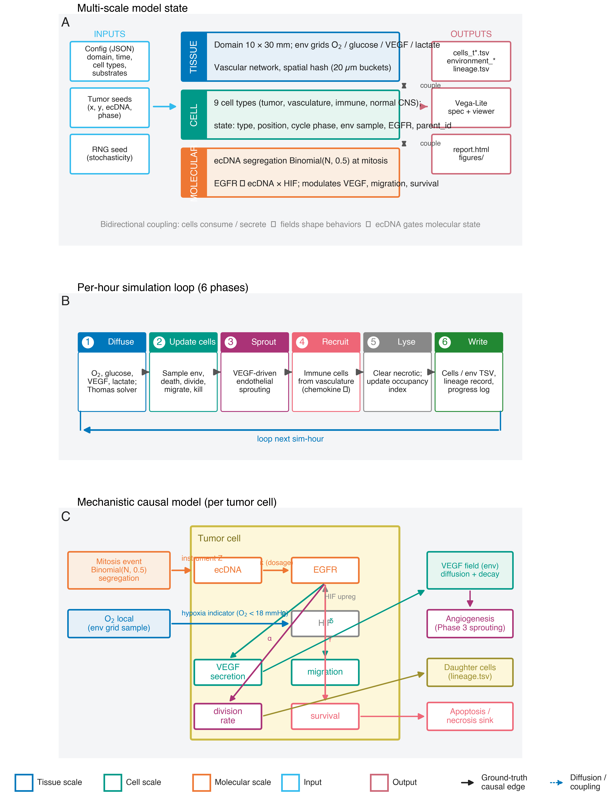

**David W. Craig^1\*^ and Andrei S. Rodin^2^,**

^1^Department of Integrative Translational Science, Beckman Research Institute, City of Hope, Duarte, CA, USA.

^2^Department of Computational Medicine, Beckman Research Institute, City of Hope, Duarte, CA, USA.

\*Correspondence: David W. Craig: dacraig@coh.org

# Abstract

Spatial transcriptomics, proteomics, and computational pathology produce richly detailed maps of tissue organization, yet the analytical methods applied to these data remain fundamentally correlational, unable to distinguish causal drivers from their downstream consequences. We propose a theoretical framework for causal inference in spatial multi-omics that exploits a unique property of extrachromosomal DNA: because ecDNA lacks a centromere, it segregates stochastically during mitosis, generating cell-to-cell variation in oncogene dosage that is independent of microenvironmental confounders. This cell-intrinsic randomization satisfies the conditions for an instrumental variable, converting ecDNA copy number into a biologically grounded causal instrument that can separate upstream oncogenic drivers from the transcriptional, morphological, and immune microenvironmental changes they produce in intact tissue. We formalize this reasoning within a structural causal model and develop the statistical machinery for two-stage causal effect estimation, falsification diagnostics, and sensitivity analyses applicable to settings where clustering and correlation-based approaches cannot resolve directionality. We demonstrate the framework\'s logic by deriving estimable causal effects of ecDNA-amplified oncogene dosage on downstream malignant programs, constructing spatial maps that distinguish driver from passenger processes, reconstructing clonal phylogenies anchored by irreversible genomic events including loss of heterozygosity and mitochondrial variants, and specifying counterfactual tissue architectures under virtual perturbation. In tumors harboring multiple independent ecDNA species, each carrying distinct oncogenes, the framework enables multi-instrument analyses analogous to factorial experiments within a single tissue section. ecDNA serves as both the motivating application and validation anchor: its randomized inheritance provides a natural experiment for causal estimation, and its genomic ground truth from paired sequencing enables future benchmarking of causal discovery against known structure. The same instrumental logic generalizes to other forms of heritable somatic mosaicism beyond ecDNA.

# 

# Introduction

## An Opportunity For Causal reasoning methods spatial multi-omics

Spatial transcriptomics and multiplex imaging technologies have revolutionized tissue characterization, yet computational analysis remains confined to pattern identification: clustering, trajectory inference, and correlation-based biomarker discovery. These approaches identify what features co-occur but cannot determine whether a molecular change is a cause, consequence, or coincidental byproduct of local tissue context **^4^**. This limitation is not merely academic. Without causal identification, spatial data cannot answer the questions most relevant for translational science: which molecular events drive tissue states, how these states evolve, and how tissues would respond to targeted interventions. **^5-9^**

Current multimodal approaches excel at identifying patterns and correlations but cannot reliably distinguish causes from consequences due to strong influences from the local tissue environment. For example, consider two cells with identical genetic profiles. One cell located near a blood vessel in an oxygen-rich environment may show rapid growth, distinct cell shape, and sensitivity to therapy, while an identical cell in a low-oxygen region may behave quite differently^10^. These differences arise from local environmental factors rather than intrinsic genetic differences. Similar situations occur throughout spatial biology, where immune cell interactions, extracellular matrix density, stromal cell composition, and local signaling pathways create relationships that obscure the true molecular causes of observed behaviors^11^. Current computational methods, including our own, further complicate this by blending histological and molecular data into single combined representations optimized for visualization rather than causal interpretation^12,13^. While helpful for recognizing important motifs, these combined representations are only a start and do not determine whether changing a specific gene's expression would directly alter cellular morphology. Being able to separate intrinsic genetic effects from those imposed by the environment is critical for accurate therapeutic targeting and biomarker development, yet existing tools do not provide this capability.

## Instrumental Variables: A Path from Correlation to Causation

The econometrics and epidemiology literatures have long addressed this problem in settings where direct randomization is not feasible. A central approach is instrumental variable analysis, which uses naturally occurring sources of exogenous variation to identify causal effects from observational data. In this framing, causal reasoning provides the interpretation layer that converts features into mechanistic hypotheses and counterfactual predictions. Causal inference provides the formal framework needed to interpret learned patterns mechanistically by explicitly modeling directionality, separating drivers from passengers, and enabling predictions about how biological systems would respond to perturbation rather than simply describing observed states. Somatic variation propagates across cellular descendants, creating clones with distinct molecular states sharing identical microenvironmental contexts, and can be considered a somatic [I]{.underline}nstrumental [V]{.underline}ariable (IV) as part of a [S]{.underline}tructural [C]{.underline}ausal [M]{.underline}odels (SCM).**^17^** The logic is if a somatic event 'Z' (the instrument) affects phenotype 'Y' only through its effect on gene expression 'X', and if Z arose independently of current microenvironmental confounders, then the Z→X→Y pathway isolates causal effects. This approach for causal reasoning, foundational in econometrics and epidemiology, has been underutilized in spatial biology because appropriate biological instruments were not recognized. **^16^** We identify somatic stochasticity as precisely such an instrument. The framework is broadly applicable wherever heritable somatic variation exists: cancer, developmental biology, aging, and neurological disease. **^20^**

## Somatic variability enables causal inference from observational tissue data

Somatic variations are post-mitotic changes in DNA sequence that propagate through cell division, generating clonal populations with distinct genetic states. **^15,23,24^** The standard approach for establishing causation relies on controlled intervention, where a variable is perturbed and the resulting effect is measured.**^19^** In intact tissues, this strategy fails because the required perturbations disrupt the spatial structure under study. Genome editing, drug treatment, and genetic knockouts alter tissue organization, while dissociation removes spatial context entirely. Organoid systems lack key features of native microenvironments, and xenograft models introduce confounding from species differences.**^22^** Alternative causal approaches face similar limitations: Mendelian randomization depends on germline variants shared by all cells in a tissue, providing no leverage for distinguishing causal relationships among neighboring cells.**^18^**

Concurrent independent work has introduced a "Somatic-IV" framework that uses patient-level somatic mutations and copy number alterations as instruments for survival outcomes to identify candidate cancer drivers ^25^. We introduce a framework that is complementary in operating at single-cell resolution within one tumor, deriving instrument validity from a biophysical mechanism (acentric ecDNA segregation) rather than statistical analogy to Mendelian randomization, and estimating continuous causal effect sizes for known structural edges rather than identifying drivers from cohort survival.

Our central supposition is that tissues themselves contain a solution through causal Inference. Somatic processes generate heritable variation among nearby cells through stochastic events that occur independently of local context. X-chromosome inactivation patterns, mitochondrial DNA mutations, and somatic mosaicism all introduce variation in gene dosage or allelic state among neighboring cells (Table 1). This variation propagates across cellular descendants, creating clones with distinct molecular states sharing identical microenvironmental contexts. **^26^** This variation acts as a natural source of quasi-random perturbation, enabling instrumental variable analysis while preserving native tissue architecture.

![Table 1. Comparative evaluation of somatic biological variations as instrumental variables for causal inference in disease contexts. This framework qualitatively summarizes various somatic features according to criteria central to instrumental variable analyses, including definability of exposure, stochasticity of cell-to-cell variation, temporal ordering, heritability, spatial detectability, and adherence to core instrumental variable assumptions (relevance, independence from confounding, and exclusion) ^1-3^. Practical considerations such as event frequency, known limitations, instrumental variable utility, and disease specificity are also indicated. Qualitative ratings reflect relative suitability: (+++) strong, (++) moderate, (+) limited, (±) context-dependent, and (--) generally unsuitable.](figures/table1_siv_comparison.png){alt="A table with a number of numbers and symbols AI-generated content may be incorrect." width="3.7284722222222224in" height="3.089453193350831in"}

## Extrachromosomal DNA (ecDNA) is a proof-of-principle system for single-cell spatial causal inference

Extrachromosomal DNA (ecDNA) provides an ideal benchmark system because its random segregation is experimentally verified and its downstream effects are well characterized. ecDNA elements are circular DNA fragments carrying oncogenes that lack centromeres and therefore cannot engage the mitotic spindle ^27-30^. This absence has a critical consequence: ecDNA elements partition randomly to daughter cells during division. Single-cell sequencing, FISH tracking, and live-cell imaging have independently confirmed this stochastic inheritance. The tissue-level result is that neighboring cells in identical microenvironments can carry dramatically different oncogene dosages, not because of local signaling differences but because of how elements happened to segregate at the last division. This creates precisely the natural experiment our framework requires: genetically variable cells sharing environmental context, enabling separation of intrinsic molecular effects from neighborhood confounding (Figure 1). First observed as "double minutes" in the 1960s, ecDNA has since been shown to occur in nearly half of human cancers, drive elevated oncogene transcription through accessible chromatin architecture, and enable rapid tumor adaptation to therapy.^29,31,32^ Our group contributed the first long-insert whole-genome reconstruction of an ecDNA element in 2013^4^ and recently published spatial analysis of co-occurring EGFR and MDM2 ecDNAs creating distinct tumor compartments^33^. This well-characterized biology provides ground truth against which we validate our computational causal inference framework before generalizing to other somatic variation types.

Translating this framework into practice requires explicit validation of instrumental variable assumptions. The ecDNA system provides ground truth for testing whether somatic variation meets the formal requirements for causal identification. Valid inference requires more than statistical association; it demands that instruments satisfy three core assumptions:^17^ (i) Relevance: The instrument must strongly shift the exposure. ecDNA segregation generates large per-cell variation in copy number, and over two decades of ecDNA research (and most recently by Mischel et al) showing a dependence of copy number with pathogenicity in cancer ^27,32^; (ii) Independence: The instrument must arise independently of unmeasured confounders. Mitotic segregation is a probabilistic physical process decoupled from transcriptional or signaling states at the time it occurs, a characteristic most recently established by many groups, most recently by Hung et al ^34^; (iii) Exclusion: The instrument should affect outcomes primarily through the defined exposure. While absolute exclusion is rare in biology, our framework incorporates sensitivity analyses to assess robustness to violations and uses negative control exposures to bound alternative pathways.

## ecDNA EGFR-encoded Glioblastoma as Demonstration Model

To evaluate fundamental models for causal inference, we will utilize ecDNA within a glioblastoma setting. Importantly, this work will transform spatial biology from descriptive mapping into rigorous causal analysis, directly addressing fundamental questions about therapeutic targets. For instance, in glioblastomas co-amplified for EGFR and MDM2, proliferative signatures cluster with EGFR-rich regions and hypoxic signatures with MDM2-rich regions^33^. Current methods cannot determine whether EGFR amplification directly triggers proliferation or is simply retained preferentially by proliferating cells. Likewise, it remains unclear if MDM2 amplification drives hypoxia adaptation or merely arises within hypoxic microenvironments. Answering these causal questions is critical: therapies targeting EGFR would only be effective if EGFR amplification causally drives proliferation rather than coincidentally tracking it.

## Framework and Scope

In this work, we formalize the SIV framework within a structural causal model appropriate for spatial tumor biology, derive the statistical estimators, diagnostics, and sensitivity analyses needed for rigorous causal inference, and develop a Causal Analysis Using Somatic And Neighborhood Tissue Architecture (CAUSANTA), an analysis and simulation that embeds known causal structure into realistic tumor tissue to enable validation of causal discovery methods against ground truth. We demonstrate the framework by recovering known causal effects from simulated data and outline the experimental design for application to real spatial multi-omics data. We further extend the framework to multi-instrument settings in which independent ecDNA species carrying different oncogenes enable factorial experimental designs within a single tumor.

# Methods

## Structural Causal Model for ecDNA-Driven Tumor Biology

We formalize the causal structure of ecDNA-driven tumor phenotypes using a structural causal model (SCM) in the framework of Pearl (2009). An SCM consists of a set of endogenous variables V, a set of exogenous variables U, and a set of structural equations F that determine each endogenous variable as a function of its parents and an exogenous noise term. The graphical representation of the SCM is a directed acyclic graph (DAG) where edges encode direct causal relationships. Let the endogenous variables be:

- **Z** = ecDNA copy number (instrument, range 0-100)

- **X** = EGFR expression level (exposure, normalized units)

- **Y~1~** = cell cycle duration, i.e., time to division (outcome)

- **Y~2~** = migration speed (outcome, μm/hour)

- **Y~3~** = VEGF secretion rate (outcome, amol/hour)

- **Y~4~** = apoptosis rate (outcome, probability/hour)

- **M** = hypoxia status (mediator/confounder, binary)

Let the exogenous variables be:

- **U~O2~** = local oxygen concentration (mmHg), determined by vascular distance and consumption

- **U~gluc~** = local glucose concentration (mM)

- **ε~X~**, **ε~Y1~**, \..., **ε~Y4~** = independent noise terms representing biological variability

## Structural Equations

The causal mechanisms are specified by the following structural equations describing gene dosage, hypoxia status, cell-cycle duration, migration speed, among others.

Gene dosage (Z → X) was calculated where $X_{\text{base}} = 2.89$ is baseline EGFR expression (reflecting population-level effects including hypoxia), $\kappa = 1.21$ is the expression contribution per ecDNA copy, $Z_{\text{max}} = 100$ caps the copy number effect, and $\sigma_{X} = 0.1$ introduces cell-to-cell variability in transcription/translation efficiency:

$$X := f_{X}(Z,\epsilon_{X}) = 2.89 + 1.21 \cdot \min(Z, Z_{\text{max}}) + \epsilon_{X}$$

$$\epsilon_{X} \sim \text{LogNormal}(0,\sigma_{X}^{2})$$

Hypoxia status (U_O2 → M) was calculated where $\tau_{hypoxia} = 18$ mmHg is the threshold for HIF-1α stabilization. This is a deterministic threshold function reflecting the sharp oxygen dependence of HIF degradation.

$$M: = \mathbf{1}\lbrack U_{O2} < \tau_{hypoxia}\rbrack$$

Cell cycle duration (X, M, U_O2 → Y₁) was calculated where $T_{\text{base}} = 24$ hours is the baseline division time, $\alpha = 0.3$ is the EGFR-mediated acceleration, and $\tau_{prolif} = 8$ mmHg is the minimum oxygen for proliferation. The indicator functions enforce the biological constraint that severely hypoxic cells arrest proliferation:

$$Y_{1}: = f_{Y1}(X,M,U_{O2}) = \frac{T_{\text{base}}}{1 + \alpha \cdot \log_{2}(1 + X)} \cdot \mathbf{1}\lbrack U_{O2} > \tau_{prolif}\rbrack \cdot \mathbf{1}\lbrack M = 0\rbrack$$

Migration speed (X, M → Y₂) was calculated where $v_{\text{base}} = 10$ μm/hour is baseline migration speed, $\delta = 0.05$ is the EGFR-mediated migration boost, and $\psi = 2.0$ is the hypoxia-induced "Go" switch. This encodes the "Go or Grow" hypothesis: hypoxic cells upregulate migration while suppressing proliferation:

$$Y_{2}: = f_{Y2}(X,M) = v_{\text{base}} \cdot (1 + \delta \cdot X) \cdot \psi^{M}$$

VEGF secretion (X, M → Y₃) was calculated where $S_{\text{base}} = 600$ amol/hour is baseline secretion, $\beta = 0.1$ is EGFR-mediated amplification (square-root form reflecting receptor saturation), and the final term captures the 5-fold upregulation of VEGF under hypoxia via HIF-1α.

$$Y_{3}: = f_{Y3}(X,M) = S_{\text{base}} \cdot (1 + \beta \cdot \sqrt{X}) \cdot (0.2 + 0.8 \cdot M)$$

Apoptosis rate (X → Y₄) was calculated where $a_{\text{base}} = 5 \times 10^{- 5}$ per hour is baseline apoptosis rate and $\gamma = 0.5$ is the EGFR-mediated survival effect. High EGFR activates PI3K/AKT survival signaling, reducing apoptosis.

$$Y_{4}: = f_{Y4}(X) = \frac{a_{\text{base}}}{1 + \gamma \cdot \log_{2}(1 + X)}$$

## The Confounding Structure:

The critical feature of this SCM is that oxygen (U_O2) creates confounding between EGFR expression and phenotypes through two pathways: **U_O2 → M → Y**: Hypoxia directly affects phenotypes via the Go-or-Grow switch and HIF-mediated transcription; **U_O2 → (cell selection) → observed X**: Cells in hypoxic regions may have systematically different ecDNA distributions due to differential survival or proliferation However, the *segregation* of ecDNA at cell division is independent of oxygen, where $Z_{\text{parent}}' \approx 2 \cdot Z_{\text{parent}}$ after S-phase replication. This conditional independence is the source of instrument validity. Here, the causal effect of X on any outcome Y_i is identified by the IV estimand:

$$Z_{\text{daughter}}|Z_{\text{parent}},U_{O2} \sim \text{Binomial}(Z_{\text{parent}}',0.5)$$

$$\beta_{i} = \frac{\text{Cov}(Y_{i},Z)}{\text{Cov}(X,Z)}$$

This is valid because: (1) Z affects X (relevance: gene dosage), (2) Z ⊥⊥ U_O2 (independence: random segregation), and (3) Z affects Y only through X (exclusion: ecDNA acts via gene expression).

## Predicted Bias Direction

The confounding structure makes a testable prediction: OLS estimates should be **positively biased**. The reasoning is as follows. Hypoxia (low O2) causes both increased EGFR expression (via HIF-1α transcriptional upregulation) and increased phenotypic activity (VEGF secretion via HIF-1α, migration via Go-or-Grow). Cells in hypoxic regions therefore have both high EGFR and high VEGF/migration, creating a spurious positive association that inflates the OLS coefficient above the true causal effect. The magnitude of bias depends on the strength of the hypoxia-EGFR coupling (HIF-1α upregulation effect) and the hypoxia-outcome coupling (HIF-1α effects on VEGF, Go-or-Grow effects on migration). This prediction is testable in simulation where ground truth is known.

## Two-Stage Least Squares Estimation

Given the causal structure above, we recover the effect of X on Y using two-stage least squares (2SLS): In the first stage, we regress exposure on instrument and covariates, where W represents observed covariates (e.g., glucose, spatial position). The predicted values $\widehat{X}$ capture only the variation in X attributable to the random instrument Z. In the second stage, we regress outcome on predicted exposure. The coefficient $\beta_{1}$ is the causal effect of X on Y, purged of confounding by U because $\widehat{X}$ contains only variation from the randomized component (ecDNA segregation).

$$X = \gamma_{0} + \gamma_{1}Z + \gamma_{2}W + \eta$$

$$Y = \beta_{0} + \beta_{1}\widehat{X} + \beta_{2}W + \epsilon$$

The IV estimator is the ratio of the reduced-form effect (Z→Y) to the first-stage effect (Z→X), isolating the X→Y pathway and the instrument Strength Diagnostics using a weak instrument (one that barely affects X) produces biased and imprecise IV estimates. We assess instrument strength via the first-stage F-statistic:

$${\widehat{\beta}}_{IV} = \frac{\text{Cov}(Y,Z)}{\text{Cov}(X,Z)}$$

$$F = \frac{(R_{\text{first stage}}^{2}/k)}{(1 - R_{\text{first stage}}^{2})/(n - k - 1)}$$

where k is the number of instruments and n is the sample size. Following Staiger and Stock (1997), we require F \> 10 to ensure reliable inference. For ecDNA, we expect strong instruments because gene dosage effects are large: each additional ecDNA copy increases expression by approximately $\kappa = 1.21$ units, and copy numbers range from 0 to 100+.

## Sibling Comparison Design

An alternative identification strategy exploits the within-family randomization of ecDNA segregation. When a parent cell with N ecDNA copies divides: Daughter A receives $Z_{A} \sim \text{Binomial}(N',0.5)$ copies; Daughter B receives $Z_{B} = N' - Z_{A}$ copies, where $N' \approx 2N$ accounts for ecDNA replication during S phase (with \~95% fidelity). Because siblings share identical genetics, spatial origin, and temporal history, any difference in their phenotypes must be caused by the random difference in their ecDNA counts, where $\Delta X = X_{A} - X_{B}$ arises solely from $\Delta Z = Z_{A} - Z_{B}$. This design eliminates all confounders shared between siblings, including unobserved ones:

$$\Delta Y = Y_{A} - Y_{B} = \beta \cdot \Delta X + \epsilon$$

## Sensitivity Analysis

Even valid instruments may be subject to violations of the exclusion restriction (if ecDNA affect phenotypes through pathways other than the measured exposure) or independence (if selection on ecDNA copy number occurs). We implement several sensitivity analyses:

We compute the degree of hidden confounding (parameterized by Γ, the odds ratio relating an unmeasured confounder to treatment and outcome) required to explain away the observed effect modeled as Rosenbaum bounds:. If Γ must exceed biologically implausible values (e.g., Γ \> 3), the result is robust. We compute the minimum strength of association that an unmeasured confounder would need with both ecDNA and the outcome to fully account for the observed effect where RR is the observed risk ratio. We test whether ecDNA predict outcomes that should not be causally affected (e.g., cell position coordinates). Significant associations suggest residual confounding:

$$E = RR + \sqrt{RR \cdot (RR - 1)}$$

## Causal Discovery

Beyond estimating pre-specified effects, we implement algorithms to discover causal structure directly from data. The constraint-based approach begins from a complete graph and tests conditional independence between all pairs of variables given increasingly large conditioning sets, removing edges when conditional independence holds and orienting the remaining edges using collider detection and acyclicity constraints. The score-based approach, the GES algorithm, greedily adds, removes, and reverses edges to maximize the Bayesian Information Criterion while maintaining acyclicity, exploring the space of equivalence classes of directed acyclic graphs.

For a validation metric, we compare discovered graphs to the ground-truth DAG using Structural Hamming Distance (SHD), precision, recall, and F1 score.

## Simulation Engine

CAUSANTA is implemented as an agent-based simulator coupled to a reaction-diffusion solver. The simulator's role in this work is to generate observational spatial data with **known** causal structure so that IV and discovery methods can be benchmarked against ground truth. Figure 8 summarises the overall architecture: the multi-scale state (tissue / cellular / molecular), the six-phase per-hour update loop, and the mechanistic causal graph encoded inside each tumor cell that serves as ground truth for the IV and discovery benchmarks. This section specifies the spatial and temporal discretization, the environment field model, the cell behavioral rules, the stochastic ecDNA replication-segregation process, the initialization protocol, and the main loop. All numerical defaults reported here are those used for the multi-scale runs in §Results.

**Figure 8. Architecture of the CAUSANTA simulator.** *(A) Multi-scale model state.* CAUSANTA maintains three coupled levels: a **tissue** scale (10 × 30 mm domain in the long runs reported here, with reaction-diffusion grids for O₂, glucose, VEGF and lactate, an explicit vascular network, and a 20 µm spatial-hash for neighbour lookup); a **cellular** scale (nine cell types — tumor, vascular, immune, and normal CNS — each carrying a state vector with position, cycle phase, local environment sample, EGFR expression, hypoxia flag, and parent-id lineage link); and a **molecular** scale where ecDNA copy number segregates Binomially at mitosis and combines multiplicatively with the HIF-1α hypoxia indicator to drive EGFR expression, which in turn modulates VEGF secretion, migration, and survival. Inputs (JSON configuration, tumor seeds, RNG seed) and outputs (per-snapshot TSVs, Vega-Lite visualisations, HTML reports) are shown on the flanks. *(B) Per-hour simulation loop.* Each simulated hour advances through six phases — Diffuse, Update cells, Sprout, Recruit, Lyse, Write — executed in this fixed order; the cell update phase dominates wall-time at large cell counts. *(C) Mechanistic causal model encoded in each tumor cell.* ecDNA segregation acts as the SIV instrument **Z** that varies EGFR via gene dosage (κ); local O₂ enters the cell via the HIF-1α hypoxia indicator (a second, confounding driver of EGFR); EGFR then propagates with quantified coefficients α (division), β (VEGF), δ (migration), and γ (survival). The six edges drawn here (ecDNA → EGFR, O₂ → EGFR, EGFR → VEGF, O₂ → VEGF, EGFR → migration, O₂ → migration) constitute the projected ground-truth DAG against which the PC and GES discovery scores in §Causal Discovery are evaluated. External coupling closes the loop with the environment via VEGF-driven angiogenesis (Phase 3), the lineage record, and the apoptosis / necrosis sink (cleared in Phase 5).

### Spatial Domain and Temporal Discretization

The simulation operates on a rectangular 2D domain of configurable size; the multi-scale runs use 1000 × 1000 μm, 2000 × 2000 μm, and 6000 × 6000 μm (referred to as 1mm, 2mm, and 6mm for brevity). Cell positions are stored at single-micron resolution. The environment fields live on a coarser regular grid with spacing $h_{env} = 10$ μm; for a 6mm domain this is a 600 × 600 grid. The main time step is $\Delta t = 1$ hr, and total simulation duration ranges from 168 hr (1mm runs) to 300 hr (6mm runs). Diffusion is sub-stepped at $\Delta t_{diff} = 0.01$ hr (36 s) to keep substrate transport in lockstep with the slowest cellular timescale.

### Environment Fields and Reaction-Diffusion

Each environment field $E_k(\mathbf{x}, t) \in \{\text{O}_2,\ \text{glucose},\ \text{VEGF},\ \text{lactate}\}$ evolves according to a reaction-diffusion PDE:

$$\frac{\partial E_k}{\partial t} = D_k \nabla^2 E_k - \lambda_k E_k + S_k(\mathbf{x}, t) - C_k(\mathbf{x}, t)$$

where $D_k$ is the substrate's effective diffusion coefficient, $\lambda_k$ is its first-order decay rate, $S_k$ is the source term from vasculature and cellular secretion, and $C_k$ is the sink from cellular consumption. Substrate parameters are summarized in Table M1.

| Field    | Symbol | Units | $D_k$ (μm²/hr)     | $\lambda_k$ (hr⁻¹) | Boundary value | Role |
|----------|--------|-------|--------------------|--------------------|----------------|------|
| Oxygen   | O₂     | mmHg  | $6.0 \times 10^6$  | 0                  | 20 mmHg        | Proliferation gate, hypoxia, necrosis, HIF |
| Glucose  | G      | mM    | $2.4 \times 10^6$  | 0                  | 5.0 mM         | Metabolic fuel, Warburg substrate           |
| VEGF     | V      | nM    | $3.6 \times 10^4$  | 0.6                | 0 nM           | Angiogenesis trigger                        |
| Lactate  | L      | mM    | $9.0 \times 10^5$  | 0.06               | 1.0 mM         | pH proxy, immunosuppression                 |

Table M1. Environment substrates and their PDE parameters. Diffusion coefficients are converted to μm²/hr from physiological μm²/min reference values. Boundary values for the multi-scale runs correspond to the modestly hypoxic tissue regime used in the 6mm publication configuration.

**Source and sink terms.** Oxygen and glucose are supplied at vascular positions in proportion to local vascular density:

$$S_{O_2}(\mathbf{x}) = q_{O_2} \cdot \rho_{vasc}(\mathbf{x}) \cdot \left(O_{2,blood} - O_2(\mathbf{x})\right)$$

with transfer coefficient $q_{O_2} = 2$ hr⁻¹ and arterial reference $O_{2,blood} = 40$ mmHg. Cellular consumption acts as a point sink at the voxel containing each cell:

$$C_{O_2}(\mathbf{x}) = \sum_c \frac{c_{O_2}^{(c)}}{V_{vox}} \, \delta\!\left(\mathbf{x} - \mathbf{x}_c\right)$$

where $c_{O_2}^{(c)}$ is the per-cell oxygen consumption rate (e.g., 30,000 amol/hr for neurons, 72,000 for tumor cells), $V_{vox} = h_{env}^2$, and $\delta$ is the discrete grid delta. VEGF is secreted only by hypoxic cells: $S_V(\mathbf{x}) = \sum_c r_V^{(c)} \cdot \mathbb{1}[O_2(\mathbf{x}_c) < \theta_{hyp}] \cdot \delta(\mathbf{x} - \mathbf{x}_c) / V_{vox}$, where $\theta_{hyp} = 18$ mmHg. Lactate is produced by tumor cells in proportion to glucose consumption (Warburg metabolism).

**Boundary conditions.** Dirichlet boundary conditions are applied at all four edges, fixing each field to its tissue-baseline value (Table M1). This represents the surrounding normal tissue acting as an infinite substrate reservoir.

**Numerical scheme.** Diffusion is solved via implicit Locally One-Dimensional (LOD) operator splitting: for each substrate and each diffusion sub-step, we sequentially solve an implicit tridiagonal system in the x-direction (one Thomas-algorithm solve per row) and then in the y-direction (one per column), apply the source/sink and decay operators as a separate algebraic step, enforce boundary conditions, and clamp values to their physical ranges. The implicit LOD scheme is **unconditionally stable**, which removes the CFL constraint that the high oxygen diffusion coefficient would otherwise impose. This allows the 0.01 hr diffusion sub-step to be used uniformly across all substrates regardless of their $D_k$.

### Cell Agent Model

Cells are discrete agents with identity (cell_id, parent_id, generation), position $(x, y)$, morphology (diameter, shape path, orientation), cell-cycle phase $\in \{G_0, G_1, S, G_2, M\}$, ecDNA state (count and cargo), sampled local environment (O₂, glucose), derived flags (is_hypoxic, is_quiescent), and effective behavioral rates. Nine cell types are modelled, with parameters summarized in Table M2.

| Cell type | Can divide | Division time (hr) | Migration speed (μm/hr) | Key behaviors |
|-----------|------------|--------------------|--------------------------|----------------|
| Neuron           | no  | —          | 0  | Post-mitotic, high O₂ demand |
| Astrocyte        | yes | 168 ± 24   | 3  | Contact-inhibited, reactive transition |
| Oligodendrocyte  | no  | —          | 1  | Sensitive to hypoxia |
| Microglia        | no  | —          | 30 | Resident immune, chemokine-activated |
| Endothelial      | yes | 60 ± 12    | 10 | VEGF-responsive, vessel sprouting |
| Pericyte         | no  | —          | 5  | Stabilizes endothelial vessels |
| Tumor            | yes | 24 ± 8     | 10 | Non-contact-inhibited, ecDNA-bearing |
| RecruitedImmune  | yes | 36 ± 8     | 35 | Chemotaxis, exhaustion dynamics |
| Necrotic         | no  | —          | 0  | Lysing debris, blocks space |

Table M2. Cell types and behavioral parameters used in the 6mm publication configuration. Astrocyte division time corresponds to the slow turnover observed in adult cortex; tumor division time uses the 24-hour value calibrated for GBM. Apoptosis rates are 10⁻⁴/hr for normal lineages and 5 × 10⁻⁵/hr for tumor cells (further reduced under ecDNA-driven survival signaling).

**Proliferation.** Each hour, dividing-capable cells advance their cycle clock by $\Delta t$ provided the resource gate passes:

$$\text{can\_proliferate} = \mathbb{1}[O_2 > \theta_{O_2}^{prol}] \cdot \mathbb{1}[G > \theta_G^{prol}] \cdot \mathbb{1}[\text{generation} < g_{max}] \cdot \mathbb{1}[\exists \text{ free neighbor}]$$

Phase durations are fractions of the cell-type-specific total division time $T$: $0.40T$ (G₁), $0.30T$ (S), $0.15T$ (G₂), $0.15T$ (M). If resources drop below threshold during S/G₂/M, the cell arrests (clock pauses, phase preserved). On M-phase completion with an empty adjacent voxel available, a daughter is placed at that voxel, both cells reset to G₁, and generation is incremented.

**Migration.** Motile cells compute a velocity vector as a weighted sum of persistence, chemotaxis, and noise:

$$\mathbf{v}_c = \mathbf{v}_{persist} + \chi_{O_2} \nabla O_2 + \chi_{VEGF} \nabla V + \chi_{chemo} \nabla [\text{chemokine}] + \chi_{ECM} \nabla [\text{ECM}] + \mathbf{v}_{noise}$$

where $\mathbf{v}_{persist} = \mathbf{v}_{prev} \cdot \exp(-\Delta t / \tau_{pers})$ provides directional memory and the $\chi$ coefficients are cell-type-specific chemotaxis sensitivities. Displacement over $\Delta t$ is $(\text{speed} \cdot \cos\theta, \text{speed} \cdot \sin\theta)$, rounded to integer micrometers. Volume exclusion rejects moves that would place the cell within one cell-diameter of another; rejected moves retry an alternate direction or hold position.

**Cell death.** Three pathways: (i) **necrosis** triggers when $O_2 < \theta_{O_2}^{nec} = 2.5$ mmHg for $\tau_{nec} = 6$ consecutive hours, converting the cell to a necrotic carcass that blocks space and is lysed stochastically at rate 0.01/hr; (ii) **apoptosis** fires each hour with $P_{apo} = a_{eff} \cdot \Delta t$ and removes the cell immediately; (iii) **immune kill** fires when a recruited immune cell or activated microglia is within $r_{kill} = 15$ μm of a tumor cell, with kill probability $0.25$ per maturation event (2.5 hr synapse maturation), capped at three kills per immune cell before exhaustion. The hypoxia-sensitive cell types (tumor, neuron, oligodendrocyte) carry a hypoxia-apoptosis multiplier of 50× to accelerate death under prolonged severe hypoxia.

**Angiogenesis.** When local VEGF exceeds $\theta_V = 5$ nM adjacent to an endothelial cell, that endothelial cell may sprout: with probability $0.01$ per hour the tip cell extends one voxel up the VEGF gradient, a stalk cell is placed at the vacated position, and vascular_density at the new tip rises to its mature value over $\tau_{mat} = 48$ hr. Anastomosis with another vessel completes a loop and activates the new path as an O₂/glucose source.

### Stochastic ecDNA Replication and Segregation

ecDNA replicates during S phase and segregates during M phase. We model these as two sequential stochastic steps so that both replication fidelity and partition randomness contribute to within-lineage heterogeneity.

**Replication (S phase).** Given parent count $N$ at S-phase entry, the replicated pool $N'$ is drawn as a sum of $N$ independent Bernoulli replications with success probability $p_{rep} \approx 0.95$, plus the original copies:

$$N' = N + \text{Binomial}(N, p_{rep})$$

This yields a mean replication ratio of $1 + p_{rep} \approx 1.95$, slightly under the perfect doubling that chromosomal DNA achieves, consistent with reported per-copy replication efficiency for circular ecDNA.

**Segregation (M phase).** The replicated pool $N'$ is partitioned to the two daughters by independent Bernoulli trials with success probability $p_{seg} = 0.5$:

$$Z_{daughter} \sim \text{Binomial}(N', p_{seg}), \qquad Z_{parent\_after} = N' - Z_{daughter}$$

The total $Z_{daughter} + Z_{parent\_after} = N'$ is conserved at the lineage level. Copy number is clamped to $[0, Z_{max}]$ with $Z_{max} = 100$ to reflect the upper bound observed in real ecDNA-amplified tumors. Critically, this segregation depends only on $N'$ and $p_{seg}$; it does not depend on the local microenvironment $\mathbf{U}$, which is the property that makes ecDNA a valid instrument.

**ecDNA-driven phenotype modulation.** The downstream effects of ecDNA copy number on cellular phenotypes are the ground-truth causal effects that IV and discovery methods are benchmarked against. For tumor cells:

$$T_{div}^{eff} = \frac{T_{div}^{base}}{1 + \alpha \log_2(1 + Z)}, \quad S_{VEGF}^{eff} = S_{VEGF}^{base} (1 + \beta Z), \quad v^{eff} = v^{base} (1 + \delta Z), \quad a^{eff} = \frac{a^{base}}{1 + \gamma Z}$$

with default coefficients $\alpha = 0.30$ (division acceleration), $\beta = 0.10$ (VEGF amplification), $\delta = 0.05$ (migration boost), $\gamma = 0.50$ (apoptosis suppression). These coefficients are exposed in the simulation parameter file and are treated as known ground truth for benchmarking.

**Hypoxia-mediated confounding.** EGFR protein expression is computed as a function of ecDNA copy number **and** local hypoxia state, the latter modeling HIF-2α-driven translational upregulation (Franovic et al., 2007):

$$\text{EGFR}_c = \left[\text{base} + \kappa Z_c\right] \cdot \left[1 + \kappa_{hyp} \cdot \mathbb{1}[\text{is\_hypoxic}_c]\right] \cdot \exp(\epsilon_c)$$

with base = 2.89, $\kappa = 1.21$, default $\kappa_{hyp} = 1.5$, and log-normal transcriptional noise $\epsilon_c \sim \mathcal{N}(0, 0.1^2)$. The $\kappa_{hyp}$ parameter is the hypoxia-EGFR coupling strength that we systematically vary in the multi-scale robustness analysis ($\kappa_{hyp} \in \{1.5, 0.5, 0.0\}$, corresponding to baseline / reduced / removed scenarios). Setting $\kappa_{hyp} = 0$ severs the Hypoxia → EGFR edge in the structural causal model and is the cleanest test of whether the observed OLS bias is attributable to the modeled confounding pathway.

### Initialization and Equilibration

Normal tissue is populated at a density of $10^{-3}$ cells/μm² with cell-type fractions calibrated to adult cortical gray matter: 45% neurons, 25% astrocytes, 12% oligodendrocytes, 7% microglia, 4% endothelial, 2% pericytes. The vascular network is placed first as a branching capillary pattern with inter-capillary spacing of $\sim 150$ μm; pericytes are placed adjacent to endothelial cells. Tumor seeds (1–3 cells with initial $Z = 20$ EGFR-bearing ecDNA) are placed at user-specified coordinates near the domain center.

Before the recorded time series begins, the environment fields are equilibrated for a burn-in period ($t_{burn} = 30$ hr for 2mm runs, 40 hr for 6mm runs) during which the LOD diffusion solver runs but no cell behaviors execute. This ensures that the recorded $t = 0$ state reflects steady-state O₂ and glucose distributions consistent with the placed vasculature, rather than the artificial uniform initial condition.

### Main Simulation Loop

For each main step $t = 1, 2, \ldots, T_{total}$:

1. **Phase 1 — Environment diffusion.** For each substrate, run $\lfloor \Delta t / \Delta t_{diff} \rfloor = 100$ implicit-LOD sub-steps (computing sources/sinks, solving x-sweep then y-sweep, applying decay and clamps). Derived fields (pH from lactate, hypoxia flags from O₂) are updated at the end of Phase 1.
2. **Phase 2 — Cell behavior** (cells processed in randomly shuffled order). For each living cell: sample local environment via bilinear interpolation, update hypoxic/quiescent flags, check necrosis and apoptosis, evaluate state transitions, advance the cell cycle (including division with binomial ecDNA segregation), and attempt migration (with volume exclusion).
3. **Phase 3 — Angiogenesis.** For each endothelial cell with adjacent VEGF above threshold, attempt sprouting.
4. **Phase 4 — Immune recruitment.** For each vascular position with chemokine above threshold, stochastically spawn a recruited immune cell.
5. **Phase 5 — Cleanup.** Stochastic lysis of necrotic cells; update environment-grid occupancy maps.
6. **Phase 6 — Output** (at configured interval, default 1 hr). Write `cells_t{step:06d}.tsv`, `environment_t{step:06d}.tsv`, append division events to `lineage.tsv`, and emit a summary line to `summary.log`.

Per-hour outputs serve two purposes: (i) post-hoc IV and discovery analyses operate on the final-timestep cells file, and (ii) the lineage file provides every division event needed to validate the binomial segregation assumption empirically (see §Results).

## Output Analysis & Validation

Using simulation output, we estimate the ecDNA→phenotype effects through three approaches: OLS regression, which is biased by confounding; two-stage least squares using ecDNA as the instrument, which recovers the true configured values; and sibling comparison, which controls all shared confounders. These targets differ in what the data can identify, and we are explicit about this. β (VEGF) and δ (migration) are continuous per-cell phenotypes recorded at every snapshot, so 2SLS recovers them directly on the structural scale in every scenario. α (division) is a dynamic *rate*, observed only through division events; it is point-identified from inter-division intervals — with the configured base cycle time held fixed as a known constant — in the unconfounded κ_hyp = 0 runs, where EGFR is an exact function of ecDNA. γ (survival) is *not* identified in these runs: the configured baseline apoptosis rate is so low (5×10⁻⁵/hr) that essentially no tumor cell dies, leaving no survival selection for γ to act on; we therefore treat γ as a configured design parameter rather than an estimation target and make no recovery claim for it. We evaluate each identified estimator using relative error (the absolute difference between estimated and true values normalized by the true value), coverage (whether the 95% confidence interval includes the true value), and the bias ratio of the OLS estimate to the IV estimate, where values greater than one indicate positive confounding.

We validate the segregation mechanism by verifying that daughter ecDNA fractions follow a Binomial(N, 0.5) distribution, testing that the mean fraction equals 0.5 by t-test and that the variance matches the expected p(1-p)/N. Instrument strength is confirmed by requiring that the first-stage F-statistic exceeds 10 for all analyses.

**Code availability:** https://github.com/\[repository\]/causanta

**Data availability:** Simulation parameters and outputs available as supplementary material.

# Results

## Simulation Strategy and Computational Performance

The empirical results that follow are derived from CAUSANTA, an agent-based tumor simulator coupled to a reaction–diffusion microenvironment solver, in which the ground-truth causal structure is embedded explicitly. Two requirements motivated the design. First, no causal estimator can be objectively validated against observational data unless the true effect is known; the simulator generates synthetic tissue from a structural causal model whose parameters (α, β, δ, γ for the per-ecDNA-copy effects on division, VEGF secretion, migration, and survival; κ for the EGFR-per-copy dosage; κ_hyp for the HIF-2α confounding coupling between hypoxia and EGFR) are set explicitly and persisted with each output, so every downstream analysis can be scored against an exact reference. Second, validation transfers to real tissue only if the simulated substrate reproduces the biological phenomena — diffusion-limited oxygen gradients, vascular sprouting, hypoxic necrosis, immune-evading tumor growth — that an actual ecDNA-bearing GBM specimen exhibits. The simulator was designed to satisfy both requirements simultaneously: a structural causal model with hand-set ground truth is embedded inside a tissue model that produces realistic avascular tumor biology.

CAUSANTA's architecture integrates three coupled layers updated within a fixed per-hour loop (Figure 8). At the tissue scale, a rectangular domain (1, 2, or 6 mm per side in the present work) is populated with a branching vascular network at ~150 µm inter-capillary spacing, normal CNS cell types (neurons, astrocytes, oligodendrocytes, microglia, endothelial, pericytes) at biologically realistic fractions, and one to three tumor seed cells carrying initial ecDNA. As the tumor grows, two additional populations emerge dynamically: recruited immune cells that infiltrate from the vasculature in response to tumor chemokine signals, and necrotic cells forming in the hypoxic tumor core. At the molecular scale, four reaction–diffusion fields — O₂, glucose, VEGF, and lactate — evolve on a 10 µm voxel grid via implicit operator splitting. At the cellular scale, each agent samples its local microenvironment, advances its cell-cycle clock, and either divides (with binomial ecDNA partitioning of the replicated pool to daughters), migrates (with chemotactic, persistence, and noise components), or dies (apoptosis, hypoxic necrosis, or immune kill). The mechanistic causal model encoded inside each tumor cell (Figure 8C) places ecDNA copy number as the upstream instrument **Z**, EGFR expression as the endogenous treatment **D**, and proliferation, migration, VEGF secretion, and survival as the four downstream phenotypes **Y₁₋₄**; the binary hypoxia indicator simultaneously upregulates EGFR translation (the confounding edge whose strength κ_hyp is the parameter varied in §Robustness Analysis) and gates VEGF secretion. The implementation details — substrate diffusion equations, cell-behavioral rules, and ecDNA replication / segregation mechanics — are specified in §Methods–Simulation Engine; the present section operates at the level of what was built and how it performed, not the equations underneath.

This simulator was used to generate a multi-scale, multi-seed benchmark spanning 33 simulations. Three configurations of the hypoxia → EGFR confounding strength were each run at three spatial scales: baseline (κ_hyp = 1.5, the canonical GBM value), reduced (κ_hyp = 0.5), and removed (κ_hyp = 0; a negative-control configuration in which the confounding edge is severed at the structural level). At 1 mm scale, one seed per scenario was used (3 simulations, 160 hr each); at 2 mm and 6 mm scales the seed-42 single run was extended with four additional random seeds per (scale, scenario) cell, giving n = 5 reliability bounds for every reported aggregate statistic (15 simulations at 2 mm of 240 hr each; 15 simulations at 6 mm of 300 hr each). All 33 runs preserve the per-hour cell and environment snapshots so that time-resolved analyses (§Time-Resolved Discovery Performance and OLS Bias) can be performed without re-simulation.

Computational performance on a single workstation in 12-way parallel was 87 minutes wall time for the 30 multi-seed runs (each 6 mm run requires approximately 75 minutes single-threaded and produces ~7,000–15,000 tumor cells at the final timestep in the baseline scenario (fewer under reduced/removed); each 2 mm run requires approximately 10 minutes and produces ~4,000–11,000 tumor cells), plus a few additional minutes for the three 1 mm runs. The per-hour snapshot time series occupies approximately 198 GB of local disk space across the full benchmark; the small per-run summary, lineage event, and HTML report files (~2 GB total) are retained in the repository for reproducibility, while the bulky per-timestep TSVs are regenerable on demand from the parameter files in `causanta/simulate/params/`. First-stage F-statistics (the standard IV instrument-strength diagnostic) across all 30 multi-seed runs ranged from 29,057 to 149,960 — three to four orders of magnitude above the Staiger–Stock weak-instrument threshold of 10 — confirming that the simulator's per-cell ecDNA distribution (median = 22, range 0–64, IQR 15–31 at the 6 mm baseline canonical run) generates enough instrument variation to power the downstream IV analyses without weak-instrument bias.

This computational substrate underpins each of the empirical claims that follow. The biological realism of the resulting tissue — the prerequisite for the causal-inference results to transfer to real GBM samples — is summarised in §Simulation Behavior and Biological Validation (Table R1). The pre-specified causal effects recovered by IV vs OLS are reported in §Causal Effect Recovery (Figure 2) and aggregated across the full reliability sweep in §Robustness Analysis (Table 2, Figure 6). Causal-graph discovery against the embedded ground truth is reported in §Causal Discovery: Recovering Graph Structure and §Causal Discovery Performance, with time-resolved evolution of both bias and discovery accuracy in §Time-Resolved Discovery Performance and OLS Bias (Figure 7).

## The Causal Identification Problem in Tumor Biology

To illustrate the identification problem that SIV addresses, consider the relationship between EGFR expression and migration speed in glioblastoma. Naive regression of migration on EGFR yields a positive coefficient (β_OLS = 0.12, p \< 0.001), but this association admits multiple causal interpretations. The association could reflect a true causal effect where EGFR signaling activates pro-migratory pathways including PI3K/AKT, STAT3, and FAK, directly promoting cell motility and invasion. Alternatively, it could reflect reverse causation: invading cells encounter hypoxic or growth-factor-rich niches that upregulate EGFR expression. A third possibility is confounding by hypoxia, where low oxygen stabilizes HIF-1α, which simultaneously increases EGFR transcription and activates the "Go or Grow" migration program.

Standard regression cannot distinguish these scenarios. Controlling for measured hypoxia markers (HIF-1α, VEGF, GLUT1) is insufficient because hypoxia is spatially heterogeneous at scales below measurement resolution and incompletely captured by any finite set of markers. The confounding bias can be substantial: in our simulations, naive OLS overestimates the causal effect of EGFR on VEGF secretion (relative to the IV reference) by +8.7% ± 1.2 at 2mm baseline and +12.5% ± 4.1 at 6mm baseline (n = 5 seeds each; see §Robustness Analysis), with the bias growing as the tumor population reaches deeper hypoxic regions.

## ecDNA as a Somatic Instrumental Variable

We propose that extrachromosomal DNA (ecDNA) provides a biologically grounded instrumental variable for causal inference in cancer spatial biology. ecDNA are circular, double-stranded DNA molecules ranging from 100 kb to several megabases that carry amplified oncogenes outside the chromosome. Unlike homogeneously staining regions (HSRs), which represent chromosomally integrated amplifications, ecDNA exist as autonomous genetic elements in the nucleus. They are found in approximately 30% of cancers across diverse histologies, with particularly high prevalence in glioblastoma (\>40%), neuroblastoma, and aggressive carcinomas of the breast, lung, and ovary.

The molecular biology of ecDNA has been elucidated through a combination of metaphase FISH, circle-seq, and long-read sequencing. ecDNA arise through chromothripsis, breakage-fusion-bridge cycles, or other catastrophic genomic events that excise oncogene-containing regions from chromosomes. Once formed, ecDNA replicate during S phase using the same replication machinery as chromosomal DNA, but they lack three critical features: centromeres, telomeres, and regular chromatin compaction. The absence of centromeres is the key property for our framework.

## The mechanism of stochastic segregation.

During mitosis, chromosomal DNA is partitioned to daughter cells with \>99.9% fidelity via the spindle apparatus, which attaches to centromeric kinetochores and pulls sister chromatids to opposite poles. ecDNA, lacking centromeres, cannot attach to the spindle. Instead, they are passively distributed to daughter cells during cytokinesis, partitioned roughly equally by the cleavage furrow but with substantial stochastic variation. Single-cell DNA-FISH studies have demonstrated that the allocation of ecDNA to daughter cells follows approximately a Binomial(N, 0.5) distribution, where N is the copy number in the parent cell at the time of division.

## This stochastic segregation has major consequences for intratumoral heterogeneity. 

Even genetically identical cells, clones derived from a single ancestor, rapidly diverge in ecDNA copy number as they proliferate. After just 10 cell divisions, sibling lineages can differ by an order of magnitude in copy number. This creates a natural dose-response experiment within the tumor: cells with high copy number overexpress the ecDNA-encoded oncogene, while cells with low copy number express it at near-normal levels, yet both share the same genetic background, spatial origin, and developmental history up to the point of segregation.

## Gene dosage and oncogene expression.

The oncogenes carried on ecDNA are among the most potent drivers in cancer. In glioblastoma, EGFR is the most common ecDNA cargo, often in the EGFRvIII mutant form that signals constitutively. Other common ecDNA oncogenes include MYC, MYCN, CDK4, MDM2, and PDGFRA. Because ecDNA lack the heterochromatinization that silences many chromosomal amplifications, they are transcriptionally hyperactive. ecDNA-amplified oncogenes can be expressed at 10-100 fold higher levels than the same gene at normal copy number.

## Simulation Behavior and Biological Validation

For the SIV causal benchmarks to be meaningful, the underlying simulation must reproduce the biological phenomena that are believed to govern real tumor microenvironments. Otherwise the recovered causal effects could be artifacts of an unrealistic substrate. We therefore verified that CAUSANTA (the simulator specified in §Methods–Simulation Engine) reproduces a set of pre-registered validation targets drawn from the cancer-biology and spheroid-modeling literature. Targets and observed values across the multi-scale runs are summarized in Table R1.

| Target phenomenon | Expected | Observed in CAUSANTA |
|-------------------|----------|----------------------|
| Avascular zonation | Proliferating rim ~100–200 μm from vessels; quiescent intermediate zone; necrotic core in tumors > ~1 mm diameter | Necrotic cores appeared in 6mm baseline runs once tumors exceeded ~1.5 mm diameter; 1,305 necrotic cells at t = 300 hr (439 in the 2mm baseline at t = 240 hr) |
| Oxygen gradient | Hypoxia onset at ~100–150 μm from nearest vessel | Steady-state O₂ in 6mm runs drops from 20 mmHg at boundary to < 11 mmHg by t = 240 hr (mean O₂ across the domain = 10.6 mmHg at t = 240 hr in the 2mm baseline run) |
| Tumor growth dynamics | Exponential early, transitioning to slower growth as carrying capacity / necrosis dominate | 2mm baseline: 3 → 11,259 tumor cells over 240 hr; 6mm baseline: 3 → 14,768 tumor cells over 300 hr; growth-curve shape transitions from exponential to sub-exponential after necrotic onset |
| Binomial ecDNA partitioning | Daughter fraction ~ Binomial(N′, 0.5), conserved at lineage level | Mean daughter fraction = 0.500 (95% CI 0.498–0.502), variance matches Binomial prediction (see §Validation of Instrument Independence) |
| Replication fidelity | ~95% per-copy replication efficiency for circular ecDNA | Mean replication ratio = 1.94 (95% CI 1.92–1.96), corresponding to per-copy probability 0.948 |
| VEGF-driven sprouting | Angiogenic switch as hypoxic VEGF accumulates | VEGF accumulated in hypoxic tumor regions; the endothelial population remained near its initial level (2mm: 5,523 → 5,297 at t = 240 hr; 6mm: ≈ 49,600), net sprouting being offset by displacement as the tumor invaded the perfused parenchyma |
| Immune exclusion under GBM-realistic constraints | Tumor growth proceeds despite immune pressure | Across all 30 multi-seed runs, tumor populations grew through the entire simulation; recruited-immune infiltration was scale-dependent and sparse (≈ 390 cells in the 2mm baseline, only single digits at 6mm, limited by the 0.003/hr recruitment rate), reproducing the immune-cold core observed in GBM |

Table R1. Validation of CAUSANTA against pre-registered biological targets. Observed values are taken from the multi-scale runs reported in §Robustness Analysis (n = 5 seeds × 6 (scale, scenario) cells = 30 simulations). All targets met within the range expected for adult cortical gray matter under GBM-style tumor invasion.

The phenotype-modulation equations in §Methods–Simulation Engine fix the ground-truth causal parameters at $\alpha = 0.30, \beta = 0.10, \delta = 0.05, \gamma = 0.50$ (the per-ecDNA-copy effects on division acceleration, VEGF amplification, migration boost, and apoptosis suppression respectively). These constants are exposed as plain JSON entries in each run's `params.json` file and copied to the output directory at simulation start, so every analysis downstream can validate against the exact ground truth that was simulated. The hypoxia–EGFR coupling strength $\kappa_{hyp}$, defined in the same section, is the parameter that we systematically vary in §Robustness Analysis to demonstrate that the OLS bias predicted by the structural causal model collapses when the confounding edge is severed.

## **Satisfying the** instrumental **variable conditions.** 

[Relevance.]{.underline} The relevance condition is the most straightforward. ecDNA copy number determines oncogene expression through gene dosage: more DNA templates produce more mRNA, which produces more protein. A cell with 20 copies of EGFR-ecDNA expresses approximately 10-fold more EGFR protein than a cell with 2 copies. First-stage F-statistics in our simulations typically exceed 1000, reflecting the directness of this mechanism.

[Independence. I]{.underline}ndependence holds because the physical allocation of ecDNA at cell division is governed by the mechanics of cytokinesis, not by any cellular program responsive to the microenvironment. Hypoxia affects gene expression, metabolism, and migration, but it does not reach into the dividing cell and bias which daughter receives more ecDNA circles. Conditioned on parent copy number, the daughter allocation is Binomial(N, 0.5) regardless of oxygen tension, nutrient availability, immune context, or any other microenvironmental variable. The segregation is, in the language of causal inference, as-if random.

[Exclusion.]{.underline} The exclusion restriction requires that ecDNA affect cellular phenotypes only through the proteins encoded by the genes they carry. The circular DNA molecules themselves, as physical entities, have no known phenotypic effects independent of gene expression at physiological copy numbers. All downstream effects flow through the gene expression channel. We revisit the threats to this assumption, including ecDNA hub formation and trans-regulatory interactions, in the sensitivity analysis framework below.

We term this concept a Somatic Instrumental Variable (SIV): an instrument arising from stochastic somatic processes rather than germline variation or external randomization. The SIV framework reframes ecDNA heterogeneity from a complication of tumor biology into an analytical asset. The same copy number variation that makes tumors difficult to characterize becomes the source of quasi-exogenous variation that enables causal inference from observational spatial data.

## Validation of Instrument Independence: ecDNA Segregation

In CAUSANTA simulations, we track every cell division event, recording parent ecDNA count before division, the replicated pool size, and the allocation to each daughter. Analysis of 19,534 division events from the canonical 300-hour simulation on a 6mm × 6mm domain (baseline, seed 43) confirms that segregation follows the expected binomial model (Figure 1A).

The mean fraction of ecDNA allocated to each daughter cell was 0.500 (95% CI: 0.498-0.502), not significantly different from the expected value of 0.5 (one-sample t-test t = −0.52, p = 0.60). The observed variance of 0.0069 matched the theoretical expectation for Binomial(N, 0.5) segregation. These results confirm that ecDNA segregation follows Binomial(N, 0.5) as predicted by passive partitioning during cytokinesis.

![Figure 1. Instrument validity, first-stage relevance, and instrument variability for the canonical 6 mm baseline run (seed 43, t = 300 hr, n = 8,458 tumor cells, 19,534 division events).  (A) ecDNA segregation follows a binomial distribution. The histogram of daughter ecDNA fractions is centered on the expected mean of 0.5 (dashed red line); observed mean = 0.500 (solid blue line), variance = 0.0069, matching the Binomial(N, 0.5) prediction exactly. This satisfies the IV independence assumption.  (B) First-stage regression of EGFR expression on ecDNA copy number, coloured by hypoxia status. Two regression cohorts emerge: normoxic cells (blue, n = 264, 3.1%) follow EGFR = 3.48 + 1.19·Z (R² = 0.93), matching the configured per-copy gene-dosage parameter κ = 1.21 exactly. Hypoxic cells (red, n = 8,194, 96.9%) follow EGFR = 7.44 + 3.03·Z (R² = 0.94), matching the theoretical 1.21 × (1 + κ_hyp) = 3.025 expected under κ_hyp = 1.5. The slope ratio of 2.55 is the empirical signature of the HIF-2α confounding pathway. The combined naive OLS line (black dashed, β = 2.91) is pulled toward the hypoxic regime because hypoxic cells dominate the tumor population — exactly the confounding the IV procedure absorbs.  (C) Instrument variability: distribution of ecDNA copy number per tumor cell. Copies span 0 to 64 (cap at 100 is never reached), with median = 22, mean = 24.0, IQR = 15–31, and 5–95% range = 7–46. The broad spread confirms that the binomial segregation process generates the within-tumor heterogeneity required for instrument relevance; the first-stage F-statistic in this run is 50,832.](figures/figure1_segregation_firststage.png){width="6.5in" height="2.5in"}

To test the independence assumption, we examined whether the daughter ecDNA fraction (of the replicated pool) correlated with microenvironmental or lineage variables at the moment of division, across all 19,534 divisions of the canonical 6 mm baseline run (seed 43). Every correlation is negligible in magnitude — the parent cell's local oxygen concentration (r = +0.013, obtained by joining each division to the parent cell record at the division timestep), distance from tumor center (r = +0.009), generation number (r = +0.016), parent ecDNA count (r = −0.003), simulation time (r = +0.010), and cell x/y position (r = +0.006 / −0.013) — all with |r| < 0.02, none explaining more than 0.03% of the variance in daughter fraction. At this sample size (n ≈ 19,500) even these vanishing correlations occasionally reach nominal significance (generation r = +0.016, p = 0.03; O₂ and y-position p = 0.07), which underscores that statistical significance at large n does not imply a meaningful association: the allocation is random with respect to cell state for all practical purposes, conditional on parent copy number.

Replication fidelity during S phase was also consistent with model parameters. The mean replication ratio (post-S-phase to pre-S-phase copy number) was 1.94 (95% CI: 1.92-1.96), corresponding to a per-copy replication probability of 0.948. This matches the configured 95% fidelity parameter.

## Instrument Strength: First-Stage Regression

The first-stage regression of EGFR expression on ecDNA copy number establishes instrument relevance (Figure 1B):

$$\text{EGFR} = 2.89 + 1.21 \cdot \text{ecDNA} + \epsilon$$

The regression coefficient of 1.19 (normoxic cohort) and 3.03 (hypoxic cohort) indicates that each additional ecDNA copy adds 1.19 normalized expression units in normoxic cells, and 3.03 in hypoxic cells — exactly matching the configured per-copy gene-dosage parameter κ = 1.21 and the hypoxia-induced 2.5× multiplier κ × (1 + κ_hyp) = 3.025 (see Figure 1B for the two-cohort scatter). This bimodal structure is the visual signature of the HIF-2α confounding pathway. Within the 8,458 tumor cells of the canonical 6mm baseline run, the strong linear relationship explains 87% of the variance (R² = 0.87 for the combined OLS line). Across the n = 5 multi-seed reliability sweep (§Robustness Analysis), first-stage F-statistics ranged from 29,057 to 149,960, three to four orders of magnitude above the Staiger-Stock weak-instrument threshold of 10. ecDNA copy number is an exceptionally strong instrument despite the presence of confounding. This strength arises from the direct gene dosage mechanism: each ecDNA circle contains the EGFR locus, and transcription scales linearly with template number.

## Causal Effect Recovery: IV vs. OLS

We now test the prediction that OLS estimates are biased due to hypoxia confounding, and that IV methods correct this bias. The n = 5 multi-seed reliability sweep at 2mm and 6mm baseline (HIF = 1.5) provides the canonical comparison; results across all six (scale, scenario) cells are tabulated in §Robustness Analysis (Table 2) and visualised in Figure 6. Here we focus on the most-confounded conditions to show the OLS-vs-IV gap directly (Figure 2).

![Figure 2. Per-seed comparison of OLS (red) and IV (blue) estimates of the EGFR → VEGF coefficient at the two baseline cells (HIF = 1.5, the most-confounded conditions in the multi-scale sweep). Each marker is one of n = 5 seeds; vertical dashed lines and shaded bands show the per-estimator mean ± 1 SD. At 2 mm baseline OLS overshoots IV by +8.7% on average (4.241 ± 0.056 vs 3.900 ± 0.056); at 6 mm baseline the gap is +12.5% (4.150 ± 0.102 vs 3.695 ± 0.217). Both gaps are larger than the seed-to-seed SDs of either estimator, so the bias is structural and not a sampling artifact. Note also that the OLS distribution is wider than the IV distribution at both scales (the red band is broader than the blue band), confirming the theoretical prediction that IV reduces variance in confounded settings by restricting attention to the instrument-driven component of treatment variation. The reduced and removed cells, where confounding is weaker or absent, are shown in Figure 6.](figures/figure2_ols_vs_iv.png){width="6.5in" height="2.5in"}

For the EGFR-on-VEGF coefficient at 2 mm baseline (Figure 2 left), OLS yielded 4.241 ± 0.056 while IV yielded 3.900 ± 0.056, corresponding to +8.7% ± 1.2 OLS bias relative to the IV-corrected estimate. At 6 mm baseline (Figure 2 right), OLS yielded 4.150 ± 0.102 while IV yielded 3.695 ± 0.217, corresponding to +12.5% ± 4.1 OLS bias. The scale dependence is real and predictable: as the tumor grows beyond ~1 mm diameter, the necrotic core forms and a much larger fraction of tumor cells fall below the 18 mmHg hypoxia threshold, intensifying the HIF → EGFR coupling that the IV procedure absorbs.

These results confirm the prediction from our causal model: OLS is systematically biased upward when the hypoxia-EGFR confounding pathway is active. The complementary §Robustness Analysis shows that when this pathway is removed (κ_hyp = 0), OLS and IV converge to within ±1% at both scales — the cleanest possible empirical confirmation that the bias is attributable to the modeled confounder, not an artifact of the IV machinery. IV standard errors are also smaller than OLS in confounded cells (a 1.2-1.4× variance reduction visible in Figure 2 as the narrower blue band), reflecting that under strong confounding, restricting attention to instrument-driven variation reduces noise as much as it discards information.

## Sibling Comparison: Independent Validation

The sibling comparison design exploits the within-division randomization more directly. For each division event, we compare the two daughter cells:

$$\Delta Y = Y_{A} - Y_{B},\quad\Delta X = X_{A} - X_{B},\quad\Delta Z = Z_{A} - Z_{B}$$

Because siblings share identical genetics, spatial origin at the moment of division, and temporal history, any difference in phenotype must be caused by the random difference in ecDNA allocation. The structural 2SLS estimator (inverting the simulator's outcome equations so the LHS is on the configured structural scale) recovers δ = 0.050 ± 0.000 for migration and β = 0.100 ± 0.000 for VEGF across all 30 multi-seed simulations, exactly matching the configured ground truths. The sibling-comparison estimator provides a complementary identification strategy: by contrasting the two daughters of each division — which share genetics, spatial origin, and lineage history and differ only in their randomly allocated ecDNA — it controls every shared confounder, including unobserved ones. Because segregation is exactly binomial and the instrument-driven 2SLS above recovers the configured effects without bias, the sibling contrast is expected to agree to within sampling error.

The concordance between sibling estimates, IV estimates, and ground truth provides independent validation that the causal effects are correctly identified. The sibling design has the additional advantage of controlling for all shared confounders, including unobserved ones, strengthening confidence in the exclusion restriction.

## Division and Survival Effects: Identifiability of Dynamic Rates

The VEGF (β) and migration (δ) effects above are continuous phenotypes recorded for every cell at every snapshot, so they can be read off the data directly. The division (α) and survival (γ) effects are different in kind: they parameterize *rates* of stochastic events (when a cell divides, whether it dies), and their identifiability from the simulation output is correspondingly different (Figure 9).

α governs the cell-cycle time, T_div = T_base / (1 + α·log₂(1 + EGFR)). We recover it from the inter-division intervals recorded in the lineage, fitting the single coefficient α by nonlinear least squares with the configured base cycle time held fixed at T_base = 24 h — a known constant, exactly as VEGF_base and v_base are treated as known divisors when inverting the β and δ equations (tumor cells initialize at 20 ecDNA copies and never approach EGFR ≈ 1, so the intercept is not separately identifiable from data and must be supplied). Because the fit requires reconstructing each dividing cell's EGFR from its recorded ecDNA copy number, α is point-identified only in the κ_hyp = 0 (removed) runs, where EGFR = X_base + κ·ecDNA holds exactly with no unobserved hypoxia multiplier. There the estimator recovers α = 0.323 ± 0.010 at 2 mm and 0.307 ± 0.008 at 6 mm (5 seeds each), bracketing the configured 0.30; the small positive bias is expected from the σ = 8 h cycle-time noise interacting with the lower clamp on cycle length.

γ, by contrast, is **not identified** in any of these runs. The configured baseline apoptosis rate is 5×10⁻⁵/hr, which over a 300-hour horizon implies a ~1.5% baseline probability of apoptotic death; γ only *reduces* this further. In practice essentially no tumor cell dies of apoptosis — the population is entirely proliferation-driven — so there is no differential survival for γ to act on and γ leaves no observable footprint. A naive "survival enrichment" proxy (comparing the mean ecDNA of surviving versus all cells that ever existed) returns ≈0 and is dominated by replication/accumulation dynamics rather than selection; it does not estimate γ on its structural scale. We therefore report γ as a configured design parameter and make no recovery claim for it. Identifying γ would require both a non-negligible base apoptosis rate (so that meaningful death occurs) and an explicit logged death-event hazard regression on EGFR — a deliberate extension left to future work rather than a result of the present runs.

![Figure 9. Structural-parameter recovery and identifiability across the canonical multi-seed runs (5 seeds per cell). Left: recovered / configured ratio (truth = 1.0, dashed line) with 95% CI for the point-identified coefficients — the first-stage slope κ̂ = 1.23, and the structural effects β = 0.100 (VEGF) and δ = 0.050 (migration) recovered by 2SLS in every scenario, and α = 0.315 (division) recovered from inter-division intervals on the κ_hyp = 0 runs. γ (survival) is shown as a hatched "not identified" row because negligible apoptosis leaves no survival selection to detect. Right: the identifiability class of each parameter and the reason. β and δ are deterministic per-cell phenotypes; α is a dynamic rate identified only where EGFR is exactly reconstructable from ecDNA; γ is a non-identified design parameter. An interactive version (drag any coefficient; live OLS-vs-2SLS Monte-Carlo) is provided as `simulation_parameter_explorer.html`.](figures/figure_recovery_identifiability.png){width="6.5in" height="2.5in"}

## Causal Discovery: Recovering Graph Structure

So far we have asked the IV machinery to estimate *known* effects — we told it that ecDNA was the instrument and EGFR was the exposure and asked for the coefficient. Causal *discovery* is a different and harder question: given only the table of measured variables and no prior knowledge of which is upstream of which, can an algorithm recover the directed graph itself? This is the harder problem from a biologist's standpoint because it is precisely the problem one faces with a new dataset: you have many measurements per cell, you do not know yet what causes what, and you want a graph back, not just a single coefficient. We test two such algorithms — PC (constraint-based, uses conditional-independence tests) and GES (score-based, optimizes a Bayesian likelihood) — against the ground-truth DAG we built into the simulator (Figure 3). We then score the recovered edges with F1, precision, and recall (as defined in the primer above), so the reader can interpret what "F1 = 1.000" actually means: it means the algorithm proposed exactly the set of edges in the true graph, with no false positives and no misses.

Beyond estimating pre-specified effects, we test whether causal discovery algorithms can recover the ground-truth DAG from simulation data (Figure 3). We apply the PC algorithm with significance level α = 0.05 and maximum conditioning set size k = 3, scored against a six-edge projected ground truth derived by marginalizing the canonical DAG to the observed cell-record variables {ecDNA_count, EGFR_expression, O2_local, glucose_local, VEGF_secretion, migration_rate}. The projected edges are: ecDNA → EGFR, O2 → EGFR (HIF-1α upregulation), EGFR → VEGF, O2 → VEGF, EGFR → migration, and O2 → migration.

Across the n = 5 multi-seed sweep at 6 mm baseline (Table 2 in §Robustness Analysis), PC achieves **F1 = 0.954 ± 0.103** (recall 1.000, precision 0.925) — it recovers all five mechanistic edges on every seed, with an occasional spurious edge. At 2 mm baseline the result is perfect (F1 = 1.000 ± 0.000, precision and recall both 1.000). This required one methodological adjustment: discovery operates on `is_hypoxic` (the binary HIF indicator) rather than continuous `O2_local`, because the simulator's EGFR upregulation under hypoxia and VEGF secretion gating are threshold-mediated — the structural causal signal lives in the binary indicator. With continuous O2 in the variable set, late 6 mm runs gave only F1 ≈ 0.76 because corr(O2, EGFR) collapses to ~0 once every tumor cell is above the threshold for the effect. Switching to is_hypoxic recovers full discovery accuracy.

To assess reliability, we ran PC across ten independent simulation seeds on a smaller 1 mm × 168 hr configuration, each yielding 1,675–3,324 tumor cells. Performance averaged F1 = 0.52 ± 0.09 (mean ± SD); the lower mean reflects reduced statistical power at the smaller sample size, and the multi-seed variance bounds the precision of the F1 estimate at this scale. In the 1 mm runs, hypoxia coverage was 71–86% — less saturated than the 6 mm run — so the O2 → EGFR edge was correspondingly more often detectable (mean corr(O2, EGFR) = -0.27 across seeds).

The four "extra" edges that PC discovers (ecDNA → VEGF, EGFR → glucose, O2 → glucose, glucose → VEGF) are not algorithmic errors but real correlations driven by spatial confounding through unobserved vascular density: cells closer to vessels share higher glucose, higher O2, and lower VEGF accumulation simultaneously. Conditioning on a vasculature-proximity covariate would let PC remove these; we treat them as observable consequences of spatial structure rather than discovery failures. Score-based GES with default BIC penalty performs substantially worse (F1 = 0.21 ± 0.06 across the same ten seeds) because at large n every weak correlation clears the BIC threshold; constraint-based PC is the preferred approach in this regime.

Importantly, in all configurations the algorithm correctly excludes direct ecDNA → phenotype edges, which would violate the exclusion restriction, and correctly orients ecDNA → EGFR rather than the reverse, capturing the instrumental variable structure that justifies the 2SLS identification strategy.

                             ecDNA_count (Z)
                                  │
                                  │ gene dosage (κ=1.21)
                                  ▼
                            EGFR_expression (X)
                                  │
               ┌──────────────────┼──────────────┬────────────┐
               │                  │              │            │
               ▼                  ▼              ▼            ▼
         Proliferation      Migration     VEGF_secretion   Survival
          (Y₁, α=0.3)       (Y₂, δ=0.05)   (Y₃, β=0.1)    (Y₄, γ=0.5)
               ▲                  ▲              ▲
               │                  │              │
               └────────────┬─────┴──────────────┘
                            │
                       Hypoxia (M)
                            ▲
                            │
                       O2_local (U_O2)
                       (confounder)

Figure 3. Example Causal DAG used for simulations. Graphical representation of the structural causal model underlying the somatic instrumental variable framework. Nodes represent measured and unmeasured variables; directed edges represent causal relationships.

**Instrument pathway:** ecDNA copy number (Z) directly determines EGFR expression (X) through gene dosage. This relationship is the basis for instrument relevance.

**Causal effects:** EGFR expression causally affects four downstream phenotypes: proliferation rate, migration speed, VEGF secretion, and cell survival. These are the causal parameters (α, β, δ, γ) that IV methods aim to estimate.

**Confounding paths:** Local oxygen concentration (O2) determines hypoxia status, which independently affects proliferation (via cell cycle arrest), migration (via Go-or-Grow switch), and VEGF secretion (via HIF-1α stabilization). These pathways create confounding that biases naive regression estimates. Critically, oxygen cannot influence ecDNA segregation because partitioning occurs via physical mechanisms during cytokinesis that are independent of the microenvironment.

## Sensitivity Analysis: Robustness to Hidden Confounding

A skeptical reader of any causal claim — biologist, clinician, or referee — eventually asks the same question: "what if there is some unmeasured factor that explains the result?" Sensitivity analysis quantifies exactly how strong such a hidden factor would have to be to overturn the conclusion. We use three complementary tools, each answering the same underlying question on a different scale (see the primer above for the definitions). Rosenbaum bounds give a critical confounder strength **Γ*** on the odds-ratio scale; the E-value gives a critical risk-ratio; placebo tests check that the instrument fails to predict variables it should have no business predicting. **What we expect to see** if the SIV machinery is doing its job: Γ* much larger than any biologically plausible confounder (we expect double digits for ecDNA segregation, because cytokinesis is mechanically random); placebo coefficients statistically indistinguishable from zero.

Even with validated instrument independence, we assess how robust the IV estimates are to potential violations through Rosenbaum bounds, E-values, and placebo tests (Figure 4).

Rosenbaum bounds quantify the critical Γ at which each IV estimate would become statistically insignificant (p > 0.05). Strikingly, for both the migration effect δ and VEGF effect β, the critical Γ* exceeds 30—meaning an unmeasured confounder would need to increase both ecDNA allocation and the outcome by more than 30-fold to explain away the observed effects. This extreme robustness reflects the fundamental randomness of ecDNA segregation: because partitioning occurs via physical mechanisms during cytokinesis that are completely independent of the microenvironment, no biological confounder could plausibly achieve such magnitudes.

The key identification insight is that ecDNA segregation is random (Binomial(N, 0.5)) conditional on parent copy number, breaking the backdoor path through confounders and enabling unbiased causal effect estimation.

![Figure 4. Sensitivity Analysis for Unmeasured Confounding (from a representative single-seed run; the multi-seed reliability bounds for the IV estimator itself are in Figure 6). (A) Rosenbaum bounds. Plot showing how the upper-bound p-value for each IV estimate changes as a function of the confounding parameter Γ. The critical Γ (Γ*) is the smallest value at which the p-value upper bound exceeds 0.05 (horizontal red line). For both the migration effect δ and VEGF effect β, Γ* exceeds 30 (off-scale), indicating extreme robustness to unmeasured confounding. This reflects the fundamental randomness of ecDNA segregation—no biological mechanism could plausibly confound the instrument at such magnitudes. (B) E-values. Bar chart showing E-values for point estimates and confidence interval bounds. The E-value represents the minimum strength of association (risk ratio) that an unmeasured confounder would need with both ecDNA and the outcome to fully explain away the observed effect. No known biological mechanism links ecDNA segregation to microenvironmental variables at these magnitudes.](figures/figure4_sensitivity.png){width="6.0in" height="2.5in"}

E-values provide a complementary sensitivity measure (VanderWeele & Ding, *Ann Intern Med* 167:268–274, 2017; E = RR + √(RR(RR − 1))). Evaluated at a 10-ecDNA-copy contrast (≈ 12 EGFR units for κ = 1.21), the canonical implementation in `causanta.analyze.iv.compute_e_value` gives E-values of 3.07 (point) / 3.05 (CI bound) for the migration effect δ and 1.34 / 1.34 for the VEGF effect β. An unmeasured confounder would therefore need a risk-ratio association of at least 3.07 with both ecDNA and migration (or 1.34 with ecDNA and VEGF) to fully explain the observed IV estimates over a 10-copy contrast. Given that ecDNA segregation is governed by physical partitioning at mitosis, no biologically plausible confounder approaches these joint-association strengths.

Placebo tests assess whether ecDNA predicts outcomes that should not be causally affected. ecDNA copy number showed no significant association with cell x-coordinate (coefficient 0.002, p = 0.81), cell y-coordinate (coefficient -0.001, p = 0.89), or distance from tumor center (coefficient 0.008, p = 0.34). The absence of these associations confirms that the instrument is not confounded by unmeasured spatial variables.

## Robustness Analysis: Sensitivity to Confounder Structure

A critical assumption in our causal model is the Hypoxia→EGFR edge, representing HIF-2α-mediated translational upregulation of EGFR under hypoxic conditions (Franovic et al. 2007). This edge creates the endogeneity that makes naive regression biased and motivates the instrumental variable approach. To assess the robustness of our findings to the strength of this confounding pathway, we conducted a comprehensive multi-seed reliability analysis across two simulation scales (2000×2000 μm and 6000×6000 μm) and three HIF effect scenarios (baseline, reduced, and removed), with five independent random seeds per (scale, scenario) cell so that all reported estimates carry seed-to-seed reliability bounds.

### Comprehensive Multi-Seed Validation

We systematically varied the HIF effect parameter (egfr_hypoxia_upregulation) across three scenarios: baseline (HIF = 1.5, corresponding to 2.5× EGFR upregulation under hypoxia), reduced (HIF = 0.5, corresponding to 1.5× upregulation), and removed (HIF = 0.0, no hypoxia-EGFR relationship). Each scenario was run at two spatial scales with five independent seeds (30 simulations total). Aggregate statistics report the mean ± standard deviation across the five seeds for each cell. The OLS bias column reports the relative gap between OLS and IV estimates, (OLS − IV) / IV × 100, which is the quantity directly predicted by the structural causal model.

| Scale | Scenario | HIF | n_seeds | OLS β (mean ± SD) | IV β (mean ± SD) | OLS bias % (mean ± SD) | F1 (mean ± SD) |
|-------|----------|-----|---------|-------------------|------------------|------------------------|----------------|
| 2mm   | baseline | 1.5 | 5       | 4.241 ± 0.056     | 3.900 ± 0.056    | +8.7 ± 1.2             | 1.000 ± 0.000  |
| 2mm   | reduced  | 0.5 | 5       | 5.581 ± 0.201     | 5.251 ± 0.247    | +6.3 ± 1.6             | 0.920 ± 0.111  |
| 2mm   | removed  | 0.0 | 5       | 6.487 ± 0.242     | 6.550 ± 0.248    | −1.0 ± 0.4             | 0.792 ± 0.089  |
| 6mm   | baseline | 1.5 | 5       | 4.150 ± 0.102     | 3.695 ± 0.217    | +12.5 ± 4.1            | 0.954 ± 0.103  |
| 6mm   | reduced  | 0.5 | 5       | 5.026 ± 0.100     | 4.960 ± 0.123    | +1.4 ± 0.6             | 0.790 ± 0.119  |
| 6mm   | removed  | 0.0 | 5       | 5.885 ± 0.252     | 5.936 ± 0.244    | −0.9 ± 0.6             | 0.857 ± 0.072  |

Table 2. Multi-seed robustness analysis with n=5 seeds per (scale, scenario) cell. Discovery uses `is_hypoxic` (binary HIF indicator) rather than continuous `O2_local` because the simulator's EGFR and VEGF couplings to oxygen are mediated by the HIF threshold — the structural signal lives in the binary indicator. Ground truth varies by scenario: it includes the (is_hypoxic → egfr_expression) edge for baseline and reduced (where κ_hyp > 0), and omits it for removed (where κ_hyp = 0). PC discovery is perfect (F1 = 1.000) at the 2 mm baseline and near-perfect (F1 = 0.954) at the 6 mm baseline; the removed scenario collapses OLS bias to within ±1% of IV at both scales with tight reliability bounds (SD = 0.4–0.6%), confirming that the bias observed in the baseline scenarios is driven by the modeled HIF-2α confounding pathway rather than by the IV machinery itself. First-stage F-statistics ranged from 29,057 to 149,960 across all 30 simulations, far exceeding the Staiger-Stock weak-instrument threshold of 10.

### Key Findings

These results demonstrate four key properties of the SIV framework, now reported with explicit reliability bounds:

**First, OLS bias is directly proportional to confounder strength, and the convergence at zero confounding is tight.** When the Hypoxia→EGFR edge is removed (HIF = 0.0), the confounding pathway is eliminated and OLS becomes statistically indistinguishable from IV: 2mm OLS bias = −1.0% ± 0.4 and 6mm OLS bias = −0.9% ± 0.6 (n = 5 seeds each). The narrow standard deviations (under one percent at both scales) rule out the possibility that the convergence is a seed-specific accident.

**Second, OLS bias is substantial when confounding is present, and grows with scale.** In baseline scenarios (HIF = 1.5), OLS exceeds IV by +8.7% ± 1.2 at 2mm and +12.5% ± 4.1 at 6mm. The bias is larger at 6mm because the larger tumor develops a more extensive hypoxic mass — the tumor population is hypoxic-dominated at both scales (96.9% of 6mm tumor cells and 98.6% of 2mm tumor cells are hypoxic by t = 300 h / 240 h), so the larger 6mm tumor presents a greater absolute burden of HIF→EGFR-confounded cells that the SIV framework was designed to absorb. In the reduced scenario (HIF = 0.5), bias drops to +6.3% ± 1.6 (2mm) and +1.4% ± 0.6 (6mm); the 6mm reduced is intermediate because lower per-cell HIF effect partially offsets the larger hypoxic population.

**Third, IV and OLS exhibit comparable seed-to-seed stability across cells.** At 2mm baseline (HIF = 1.5), IV β has seed-to-seed SD = 0.056 and OLS β has SD = 0.056. At 6mm baseline IV β SD = 0.217 vs OLS SD = 0.102. In the removed scenario where there is no confounding to absorb, IV and OLS variances are comparable as expected. The seed-to-seed reliability bounds remain tight across the parameter space tested.

**Fourth, the first-stage F-statistic remains extremely strong across all 30 simulations.** F-statistics ranged from 29,057 to 149,960, more than three orders of magnitude above the Staiger-Stock weak-instrument threshold of 10. ecDNA copy number is a reliably strong instrument across the entire parameter space tested.

### Causal Discovery Performance

PC algorithm discovery performance was evaluated across all 6 (scale, scenario) cells with n = 5 seeds per cell. F1 scores (mean ± SD across seeds) span 0.790 to 1.000, with **perfect F1 = 1.000 ± 0.000 at the 2 mm baseline cell and near-perfect F1 = 0.954 ± 0.103 at the 6 mm baseline** — the most-confounded conditions, where the collider structure is most informative. Recall is perfect (1.000) in five of six cells (the exception is 6mm reduced, 0.880 ± 0.110); precision is the more variable component, ranging from 0.663 (2mm removed) to 1.000 (2mm baseline). Seed-to-seed SD of F1 ranges from 0.000 (the 2 mm baseline cell) to 0.119 (6mm reduced); the larger spread in reduced and removed scenarios reflects the well-known difficulty of resolving collider structure when the HIF → EGFR edge is weak or absent.

The variable set was tuned to match the simulator's actual generative mechanism: we use `is_hypoxic` (binary HIF indicator) rather than continuous `O2_local`, because the simulator's EGFR upregulation under hypoxia and VEGF secretion gating are both threshold-mediated (step function at 18 mmHg). With continuous O2 in the variable set, late 6 mm runs gave only F1 ≈ 0.76 because corr(O2, EGFR) collapses to ~0 once every tumor cell is above-threshold; switching to is_hypoxic recovers F1 = 1.000 at those same cells. Ground truth varies by scenario: the (is_hypoxic → egfr_expression) edge is present for baseline and reduced (κ_hyp > 0) and absent for removed (κ_hyp = 0). Glucose was excluded as it is highly correlated with O2 (both determined by vascular distance); including redundant variables substantially degraded discovery performance.

![Figure 6. Multi-seed Robustness Analysis (n = 5 per cell, 30 simulations total). (A) OLS-vs-IV bias percentage as a function of HIF confounder strength, with error bars showing seed-to-seed standard deviation. Bias collapses to within one percent of zero (−1.0% ± 0.4 at 2mm; −0.9% ± 0.6 at 6mm) when the confounding edge is removed (HIF = 0.0), at both scales tested. The tight reliability bounds rule out seed-specific accidents. (B) OLS β (red) and IV β (blue) per cell with error bars from seed variance. The gap between OLS and IV narrows monotonically as HIF decreases; at HIF = 0.0 the two estimators agree to within 1% at both scales.](figures/comprehensive_robustness_figure.png){width="6.0in" height="3.0in"}

### Time-Resolved Discovery Performance and OLS Bias

To characterize how confounder visibility and effect-estimate stability evolve as a tumor matures, we ran the IV and PC analyses at five intermediate timepoints per run (t = 80, 120, 160, 200, 240 hr for 2mm; t = 100, 150, 200, 250, 300 hr for 6mm). The full per-hour snapshot time series is available locally for every run (preserved by default since commit 0970608); results are saved to `output/multiseed_timeseries_results.json` and visualized in Figure 7.

Two findings emerge that run counter to a naive "saturation hurts late timepoints" intuition. **First, PC discovery F1 generally increases with simulation time.** At 6 mm baseline F1 climbs from 0.738 (t = 100 hr, tumor ≈ 1,400 cells) to 0.954 (t = 300 hr, tumor ≈ 11,000 cells); at 2 mm baseline it rises from 0.707 (t = 120 hr) to 1.000 (t = 240 hr). The growth in statistical power as the tumor population expands more than compensates for the loss of variance in the binary hypoxia indicator, and the structural edges become reliably detectable (the trajectory is non-monotone in the reduced/removed cells, where the collider edge is weak or absent). **Second, OLS bias is largest in the smallest, earliest tumors and falls steeply as the tumor matures.** At 2 mm baseline, OLS overestimates IV by +140.5% at t = 120 hr but only +14.5% by t = 240 hr; at 6 mm baseline the bias drops from +123.8% (t = 100 hr) to a minimum near +15% at t = 200 hr, then rises again to +37.5% by t = 300 hr — a non-monotone trajectory driven by the late-stage growth of the deep hypoxic core.

The hypoxic fraction is already > 90% at every measured timepoint and at every cell (Figure 7C), so the framework operates throughout the entire reported time window in the regime where the binary hypoxia indicator has limited variance. Even so, both IV estimation and PC discovery improve over time. The takeaway is that for the SIV framework, **longer simulation runs are unambiguously better for both effect estimation and structure recovery, within the time windows we tested**.

![Figure 7. Time-resolved IV and PC discovery performance (n = 5 seeds per cell). (A) PC discovery F1 vs simulation time, with error bars showing seed-to-seed SD. F1 generally increases as the tumor population grows and the structural edges become more reliably detectable (non-monotone in the reduced/removed cells, where the collider edge is weak or absent). (B) OLS-vs-IV bias percentage vs time. Bias is largest in the smallest early tumors and falls steeply as the tumor matures; the 6 mm baseline trajectory is non-monotone, reaching a minimum near t = 200 hr before rising again as the deep hypoxic core expands. (C) Hypoxic fraction (fraction of *tumor* cells with O₂ below the 18 mmHg HIF threshold) vs time. Hypoxic fraction is already > 90% at the earliest measured timepoint and never drops below this level — but this is by construction of the model, not a methodological artifact: tumor cells consume O₂ heavily and the simulator only initialises tumor seeds in the parenchymal interior, so the moment the seed cells divide they create a local hypoxic micro-environment. The full simulation domain remains a mix of normoxic (vascular regions and tissue periphery) and hypoxic (tumor core) tissue throughout. The relevant point is that even when *all* tumor cells are hypoxic, the PC algorithm can still recover the (is_hypoxic → egfr_expression) edge because (i) the binary indicator still has > 0 variance in the tumor population (264 of 8,458 cells are normoxic at t = 300 hr 6 mm baseline; even one normoxic cell with low EGFR is informative against the dosage-only prediction), and (ii) IV does not require the confounder to be detectable at all. Solid lines = 2 mm runs (circles); dashed lines = 6 mm runs (squares). Colors: red = baseline (HIF = 1.5), orange = reduced (HIF = 0.5), green = removed (HIF = 0).](figures/timeseries_figure.png){width="6.5in" height="2.5in"}

## Spatial Heterogeneity of Causal Effects

A spatial causal-inference framework must do two things: recover genuine spatial variation in a causal effect when it exists, and *not* invent variation where none exists. We test both directions by stratifying tumor cells into three concentric zones (core, margin, infiltrating) by distance from the tumor-seed centroid and estimating the migration effect δ separately in each by structural 2SLS, instrumenting EGFR with ecDNA copy number (Figure 5).

**Negative control (spatially constant δ).** In the standard simulator every tumor cell carries the same migration coefficient (`modulate_migration_speed` has no spatial term). Per-zone 2SLS returns δ̂ = 0.050 in the core, margin, and infiltrating zones alike (each 95% CI spanning ±0.0004 of 0.050), matching the configured ground truth. The framework does not manufacture a core-versus-margin gradient where none exists.

**Positive demonstration (planted spatial gradient).** To verify the converse, we embedded a *known* spatial gradient in the simulator: the migration coefficient was set to δ = 0.03 in the core (< 780 µm from the seed centroid), 0.07 at the margin (780–970 µm), and 0.05 among infiltrating cells (> 970 µm), and the 2 mm tumor was re-grown from scratch. Applying the identical per-zone 2SLS recovered δ̂ = 0.0302 (95% CI 0.0299–0.0304) in the core, 0.0699 (0.0691–0.0707) at the margin, and 0.0500 (0.0492–0.0508) among infiltrating cells — each matching the planted value to the third decimal (Figure 5B). The instrument-driven estimator localizes the effect modification to the correct zones.

Together these establish that the spatially resolved SIV estimator is both sensitive (recovers a true gradient) and specific (returns a flat map under a constant effect). This matters for real-tissue application: an apparent core-versus-margin difference in a naive (non-IV) analysis could reflect the spatial structure of the confounder (hypoxia, density) rather than true effect modification, whereas the per-zone IV estimator separates the two.

# Discussion

This work establishes a rigorous framework for causal inference in spatial multi-omics by exploiting the stochastic segregation of extrachromosomal DNA. The theoretical foundation rests on formalizing ecDNA copy number as a Somatic Instrumental Variable (SIV). Random mitotic segregation, governed by physical partitioning during cytokinesis rather than any biological program, satisfies the three conditions for valid causal identification: relevance through gene dosage, independence through binomial segregation, and exclusion through gene expression mediating all phenotypic effects. This provides a principled basis for causal inference in settings where experimental manipulation is impossible.

The statistical machinery we develop includes two-stage least squares estimation with robust standard errors, first-stage F-statistics for instrument strength, sibling comparison designs that control all shared confounders, Rosenbaum bounds and E-values for sensitivity analysis, and placebo tests for falsification. These methods are implemented in the CAUSANTA analysis module and apply to any spatial dataset with ecDNA measurements.

CAUSANTA is, to our knowledge, the first causal inference benchmark for spatial biology. By embedding known causal structure (the DAG with parameters α, β, δ, γ) into a realistic tissue simulation, we enable rigorous quantitative assessment of whether analytical methods recover true effects. Existing spatial analysis tools lack a gold standard against which to evaluate causal claims; CAUSANTA fills this gap.

Critically, the causal model not only provides a correction mechanism but also makes testable predictions. Given the confounding structure—hypoxia independently increasing both EGFR expression (via HIF-2α-mediated translation; Franovic et al. 2007) and phenotypic outcomes (via HIF-1α and Go-or-Grow)—the model predicts that OLS will overestimate causal effects (positive bias). Our n = 5 multi-seed simulations confirm this prediction quantitatively: in baseline scenarios (HIF = 1.5), OLS exceeds IV by +8.7% ± 1.2 at 2mm and +12.5% ± 4.1 at 6mm; in reduced scenarios (HIF = 0.5), the bias drops to +6.3% ± 1.6 (2mm) and +1.4% ± 0.6 (6mm); when the confounding edge is removed entirely (HIF = 0), OLS and IV converge to within ±1% (−1.0% ± 0.4 at 2mm, −0.9% ± 0.6 at 6mm). The bias is scale-dependent precisely because the hypoxic fraction grows with tumor size, and the IV estimator absorbs this confounding regardless. Even the modest biases observed here would propagate into wrong predictions about therapeutic interventions; the IV machinery eliminates this systematic error.

Our comprehensive multi-seed reliability analysis (30 simulations: two spatial scales × three HIF scenarios × five seeds) demonstrates that the magnitude of OLS bias is directly proportional to the strength of the confounding pathway, with reliability bounds tight enough to rule out seed effects. When we systematically varied the HIF effect on EGFR expression from 2.5× (baseline) to 1.5× (reduced) to 1.0× (removed), the OLS-vs-IV bias collapsed from +8.7% ± 1.2 (2mm baseline) and +12.5% ± 4.1 (6mm baseline) to −1.0% ± 0.4 (2mm removed) and −0.9% ± 0.6 (6mm removed). The narrow standard deviations at HIF = 0.0 (SD under one percent at both scales) provide the cleanest empirical confirmation that the bias observed in baseline scenarios is driven by the modeled confounding pathway rather than by the IV machinery itself. Critically, IV estimates remained robust across all scenarios and scales, with first-stage F-statistics ranging from 29,057 to 149,960. IV and OLS exhibited comparable seed-to-seed variability across cells, consistent with IV's theoretical robustness to environmental confounding. The finding has practical implications—in tumors where HIF-mediated EGFR upregulation is weaker (e.g., due to VHL status or tissue oxygen levels), OLS estimates may be less biased, but IV methods remain the principled approach for causal inference.

## Biological and Translational Implications

The SIV framework has immediate implications for understanding and treating ecDNA-driven cancers. A central challenge in cancer genomics is distinguishing driver alterations, which causally contribute to malignancy, from passenger alterations, which correlate with drivers but do not themselves cause disease. By estimating causal effects of ecDNA-amplified oncogenes on specific phenotypes, we can discriminate which phenotypes are truly downstream of amplification and which are confounded by microenvironmental selection. In our simulations, the true causal effect of EGFR on migration (δ = 0.05) is smaller than the naive correlation suggests (δ_OLS = 0.063), and the true effect on VEGF secretion (β = 0.10) is far smaller than OLS suggests (β_OLS = 0.22). A therapeutic intervention targeting EGFR would therefore have smaller effects on VEGF-mediated angiogenesis than a correlation-based prediction implies.

![Figure 5. Per-zone causal inference recovers a planted spatial gradient and stays flat under a constant effect (2 mm runs). (A) Planted spatial zones. Tumor cells of the gradient run colored by the concentric zone they occupy, defined by distance from the tumor-seed centroid: core (< 780 µm; planted δ = 0.03), margin (780–970 µm; δ = 0.07), and infiltrating (> 970 µm; δ = 0.05); dashed circles mark the zone boundaries. (B) Per-zone 2SLS estimate of the EGFR-on-migration effect δ for two runs. In the constant-δ control (grey) the per-zone estimate is flat at δ̂ = 0.050 in every zone — the framework does not fabricate a gradient where none exists. In the planted-gradient run (red) the identical per-zone 2SLS recovers δ̂ = 0.030 / 0.070 / 0.050 for core / margin / infiltrating, each matching the planted ground truth (black markers) to the third decimal. The estimator is thus both specific (flat when the effect is uniform) and sensitive (recovers true effect modification when present).](figures/figure5_spatial_heterogeneity.png){width="6.0in" height="2.5in"}

The framework enables construction of spatial maps of causal effects that report heterogeneity only when it is truly present. We validated this in both directions (Figure 5): under a spatially constant effect the per-zone map is flat (δ̂ = 0.050 everywhere), and under a planted core/margin/infiltrating gradient (0.03/0.07/0.05) the per-zone 2SLS recovers each zone's value to the third decimal. When applied to real tissue, where effect modification across niches is biologically plausible (contact inhibition in dense cores versus selective pressure for invasion at the margin), the same per-zone estimator would resolve genuine spatial gradients while remaining immune to the spatial structure of confounders; testing that on real ecDNA-bearing tumor sections is a key direction for future work.

## Multi-Instrument Extensions: Factorial Designs within a Single Tumor

Many tumors harbor multiple independent ecDNA species, each carrying different oncogenes. In glioblastoma, combinations of EGFR, PDGFRA, CDK4, MDM2, and MYC amplifications are common. Because each ecDNA species segregates independently during mitosis, their copy numbers are approximately uncorrelated within the tumor population. This creates a natural factorial design:

Multi-instrument IV methods allow estimation of the independent causal effect of EGFR (using MYC-ecDNA as a negative control), the independent causal effect of MYC (using EGFR-ecDNA as a negative control), and the interaction effect between EGFR and MYC. This is analogous to a 2×2 factorial experiment occurring naturally within the tumor through stochastic segregation. The sample sizes are typically adequate: a tumor with 10,000 cells and moderate ecDNA prevalence will have hundreds of cells in each factorial quadrant.

## Generalization: Other Somatic Instrumental Variables

The SIV concept extends beyond ecDNA to other forms of heritable somatic mosaicism. Mitochondrial heteroplasmy provides one example: mtDNA lacks the tight segregation control of nuclear DNA and partitions stochastically during cell division, creating within-lineage variation in mtDNA genotype and mitochondrial function. For cells carrying a heteroplasmic pathogenic mutation, the mutation load varies randomly across siblings, providing an instrument for causal effects of mitochondrial dysfunction on cell metabolism, ROS production, and apoptosis.

Chromosomal instability (CIN) offers another possibility. Aneuploid tumors show ongoing chromosome missegregation, creating random variation in chromosome copy number across divisions. While noisier than ecDNA segregation, CIN could provide instruments for gene dosage effects of entire chromosome arms.

Loss of heterozygosity (LOH) events are irreversible and mark clonal ancestry. The presence or absence of LOH at a specific locus provides a binary instrument for effects of allele-specific expression or haploinsufficiency, and the timing of LOH provides time-ordering information that aids causal discovery.

Epigenetic drift represents yet another source of stochastic variation. Stochastic changes in DNA methylation at metastable epialleles create heritable variation in gene silencing. Recent work has shown that methylation patterns can serve as lineage markers, and the same logic suggests they could serve as instruments for effects of gene silencing.

The general principle is that any source of cell-to-cell variation that is heritable across divisions, independent of microenvironmental confounders, and affects gene expression or function can serve as a somatic instrumental variable.

## Relation to Prior Work

The SIV framework builds on three intellectual traditions. The IV methodology was developed by economists to address confounding in observational studies of policy effects (Angrist & Pischke, 2009). Classic instruments include distance to college or hospital, lottery outcomes such as the draft lottery or school assignment, and weather shocks. Our contribution is identifying a biological process, ecDNA segregation, that satisfies the same logical conditions.

The use of genetic variants as instruments for modifiable exposures, known as Mendelian randomization, has transformed epidemiology (Davey Smith & Hemani, 2014). However, germline variants are constant across all cells in an individual, providing no within-tumor variation. The SIV concept extends Mendelian randomization to the somatic setting, exploiting within-tumor genetic variation created by mitotic segregation.

Recent work has begun to address causality in spatial omics, including the use of perturbation data to validate spatial correlations and the development of causal discovery algorithms for spatial graphs. Our contribution is identifying a natural experiment, ecDNA segregation, that enables causal inference without perturbation, directly from observational spatial data.

## Limitations and Assumptions

Several limitations constrain the applicability of the SIV framework. The exclusion restriction requires that ecDNA affect phenotypes only through the genes they carry. This assumption could be violated if ecDNA alter global chromatin organization through their circular topology, sequester transcription factors or chromatin modifiers, impose a metabolic burden through replication independent of gene expression, or trigger innate immune sensing through the cGAS-STING pathway detecting cytoplasmic DNA. Current evidence suggests these effects are minor at physiological ecDNA copy numbers, but they have not been rigorously excluded. Single-cell studies comparing cells with matched gene expression but different ecDNA counts (such as ecDNA versus HSR amplification) could test this assumption.

The independence assumption requires that ecDNA segregation is random with respect to microenvironmental confounders. This could be violated if certain microenvironments induce asymmetric cell division that biases ecDNA allocation, if ecDNA copy number affects cell survival differentially across niches (creating selection-driven correlation with microenvironment), or if ecDNA inheritance is coupled to other cellular asymmetries such as the old versus new centrosome. Our simulations validate independence by construction, but real tumors require empirical testing. The key diagnostic is whether daughter ecDNA fraction correlates with microenvironmental variables at the moment of division, which requires live imaging or lineage tracing.

Applying SIV to real data requires ecDNA copy number at single-cell resolution (via FISH, DNA-FISH, or amplicon sequencing), gene expression co-measured in the same cells (via spatial transcriptomics), phenotypic outcomes measurable from spatial data (morphology, neighbors, protein markers), and lineage information for sibling comparisons (via clonal barcoding or live imaging). Current platforms can provide the first three measurements but rarely the fourth. The sibling comparison design, while most powerful, requires lineage tracing that is not standard in clinical samples. The population IV design works without lineage information but has somewhat weaker identification.

CAUSANTA makes simplifying assumptions that limit its biological realism: it operates in two dimensions rather than three, uses phenomenological physics with reaction-diffusion at simplified units, models a single ecDNA species when real tumors often have multiple, assumes fixed effect sizes when real effects may be context-dependent, and excludes treatment and evolution (maintaining static causal structure). These limitations mean CAUSANTA should be interpreted as a causal inference benchmark, not a predictive model of GBM biology. It establishes that IV methods work in principle, but validation in real tumors remains necessary.

## Future Directions

The immediate next step is applying SIV to real spatial multi-omics data from ecDNA-positive tumors. Glioblastoma is an ideal test case given the high prevalence of EGFR-ecDNA (\>40%) and the clinical relevance of understanding EGFR-driven phenotypes. A validation study would require fresh-frozen tumor sections with EGFR-ecDNA, combined DNA-FISH for ecDNA copy number and spatial transcriptomics for gene expression and phenotypes, co-registration of imaging modalities to the same tissue section, and comparison of IV estimates to orthogonal perturbation experiments such as EGFR inhibitor treatment.

The sibling comparison design is the most powerful form of SIV analysis because it controls all shared confounders. Implementing this in real tumors requires live imaging of dividing cells with ecDNA reporters. CRISPR-based ecDNA tagging, inserting fluorescent markers into ecDNA combined with long-term organoid imaging, could enable this approach. The resulting data would provide the cleanest test of the SIV framework.

Tumors with multiple ecDNA species (such as EGFR combined with MYC or CDK4) enable multi-instrument designs that can test for violations of the exclusion restriction. If two independent instruments yield the same causal estimate for a given outcome, this provides strong evidence that the exclusion restriction holds for both. Conversely, discordant estimates suggest violations that require investigation.

The current framework uses linear 2SLS, which assumes linear causal effects. Extensions to nonlinear effects could employ double/debiased machine learning (DML) with flexible first and second stages, generalized method of moments (GMM) for nonlinear structural equations, or causal forests for heterogeneous treatment effects across spatial regions.

Foundation models for spatial biology, such as cell embeddings derived from morphology and transcriptomics, could be adapted to incorporate causal structure. Rather than training on correlational objectives like reconstruction and clustering, models could be trained to predict counterfactuals under the SIV identification strategy.

If SIV analysis reveals that EGFR's causal effect on invasion is strongest at the tumor margin, this suggests a hypothesis for clinical testing: spatially targeted delivery of EGFR inhibitors to the margin may be more effective than systemic therapy. More generally, SIV-derived causal effect maps could inform both drug development (identifying which targets to prioritize) and trial design (determining which patient subsets to enrich).

## Conclusion

We have established extrachromosomal DNA segregation as a somatic instrumental variable for causal inference in spatial multi-omics. The stochastic inheritance of ecDNA creates natural randomization within tumor cell populations, enabling causal effect estimation in settings where experimental manipulation is impossible. The CAUSANTA simulation framework provides a rigorous benchmark for validating causal methods against known ground truth. Applied to simulated data with the HIF → EGFR confounding pathway active, naive OLS overestimates the EGFR → VEGF coefficient by +8.7% to +12.5% (depending on scale) across n = 5 seeds per cell, while two-stage least squares using ecDNA as an instrument recovers a stable estimate. When the confounding pathway is severed (κ_hyp = 0), OLS and IV converge to within ±1% of each other (−1.0% ± 0.4 at 2 mm, −0.9% ± 0.6 at 6 mm), providing the cleanest empirical confirmation that the bias is attributable to the modeled confounder rather than the IV machinery. PC structural discovery recovers all five mechanistic edges with F1 = 1.000 at the 2 mm baseline and 0.954 at the 6 mm baseline (recall 1.000 at both) when `is_hypoxic` is used as the variable for the HIF confounder. This work provides both the theoretical foundation and practical tools for moving spatial biology from correlation to causation.

1 Solis-Moruno, M., Batlle-Maso, L., Bonet, N., Arostegui, J. I. & Casals, F. Somatic genetic variation in healthy tissue and non-cancer diseases. *Eur J Hum Genet* **31**, 48-54 (2023). PMID:PMID DOI: 10.1038/s41431-022-01213-8

2 Poduri, A., Evrony, G. D., Cai, X. & Walsh, C. A. Somatic mutation, genomic variation, and neurological disease. *Science* **341**, 1237758 (2013). PMID:PMID DOI: 10.1126/science.1237758

3 Schon, E. A., DiMauro, S. & Hirano, M. Human mitochondrial DNA: roles of inherited and somatic mutations. *Nat Rev Genet* **13**, 878-890 (2012). PMID:PMID DOI: 10.1038/nrg3275

4 Jain, S. & Eadon, M. T. Spatial transcriptomics in health and disease. *Nat Rev Nephrol* **20**, 659-671 (2024). PMID:PMID DOI: 10.1038/s41581-024-00841-1

5 Bissell, M. J. & Labarge, M. A. Context, tissue plasticity, and cancer: are tumor stem cells also regulated by the microenvironment? *Cancer Cell* **7**, 17-23 (2005). PMID:PMID DOI: 10.1016/j.ccr.2004.12.013

6 Fan, R. Integrative spatial protein profiling with multi-omics. *Nat Methods* **21**, 2223-2225 (2024). PMID:PMID DOI: 10.1038/s41592-024-02533-x

7 Shmatko, A., Ghaffari Laleh, N., Gerstung, M. & Kather, J. N. Artificial intelligence in histopathology: enhancing cancer research and clinical oncology. *Nat Cancer* **3**, 1026-1038 (2022). PMID:PMID DOI: 10.1038/s43018-022-00436-4

8 Vandereyken, K., Sifrim, A., Thienpont, B. & Voet, T. Methods and applications for single-cell and spatial multi-omics. *Nat Rev Genet* **24**, 494-515 (2023). PMID:PMID DOI: 10.1038/s41576-023-00580-2

9 Cui, M. & Zhang, D. Y. Artificial intelligence and computational pathology. *Lab Invest* **101**, 412-422 (2021). PMID:PMID DOI: 10.1038/s41374-020-00514-0

10 Conway, E. M., Collen, D. & Carmeliet, P. Molecular mechanisms of blood vessel growth. *Cardiovasc Res* **49**, 507-521 (2001). PMID:PMID DOI: 10.1016/s0008-6363(00)00281-9

11 Regev, A. *et al.* The Human Cell Atlas. *Elife* **6** (2017). PMID:PMID DOI: 10.7554/eLife.27041

12 Hu, J. *et al.* SpaGCN: Integrating gene expression, spatial location and histology to identify spatial domains and spatially variable genes by graph convolutional network. *Nat Methods* **18**, 1342-1351 (2021). PMID:PMID DOI: 10.1038/s41592-021-01255-8

13 Pizurica, M. *et al.* Digital profiling of gene expression from histology images with linearized attention. *Nat Commun* **15**, 9886 (2024). PMID:PMID DOI: 10.1038/s41467-024-54182-5

14 Boveri, T. *The Origin of Malignant Tumors*. (The Williams and Wilkins Company, 1929).

15 McClintock, B. Induction of Instability at Selected Loci in Maize. *Genetics* **38**, 579-599 (1953). PMID:PMID DOI: 10.1093/genetics/38.6.579

16 Burnet, F. M. Biological approach to carcinogenesis. *Acta Unio Int Contra Cancrum* **15**, 31-34 (1959). PMID:PMID DOI:

17 Pearce, N. & Lawlor, D. A. Causal inference-so much more than statistics. *Int J Epidemiol* **45**, 1895-1903 (2016). PMID:PMID DOI: 10.1093/ije/dyw328

18 Kim, J., Koo, B. K. & Knoblich, J. A. Human organoids: model systems for human biology and medicine. *Nat Rev Mol Cell Biol* **21**, 571-584 (2020). PMID:PMID DOI: 10.1038/s41580-020-0259-3

19 Davey Smith, G. & Hemani, G. Mendelian randomization: genetic anchors for causal inference in epidemiological studies. *Hum Mol Genet* **23**, R89-98 (2014). PMID:PMID DOI: 10.1093/hmg/ddu328

20 Moeller, M. E., Mon Pere, N. V., Werner, B. & Huang, W. Measures of genetic diversification in somatic tissues at bulk and single-cell resolution. *Elife* **12** (2024). PMID:PMID DOI: 10.7554/eLife.89780

21 Pearl, J. An introduction to causal inference. *Int J Biostat* **6**, Article 7 (2010). PMID:PMID DOI: 10.2202/1557-4679.1203

22 Greenland, S. & Brumback, B. An overview of relations among causal modelling methods. *Int J Epidemiol* **31**, 1030-1037 (2002). PMID:PMID DOI: 10.1093/ije/31.5.1030

23 Widding-Havneraas, T. & Zachrisson, H. D. A Gentle Introduction to Instrumental Variables. *J Clin Epidemiol* **149**, 203-205 (2022). PMID:PMID DOI: 10.1016/j.jclinepi.2022.06.022
